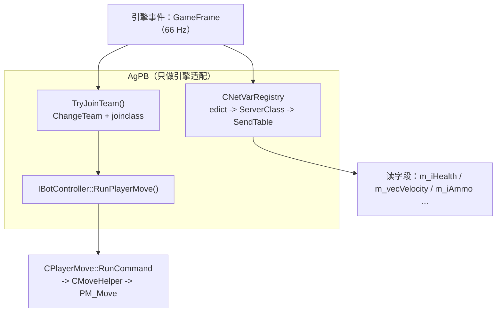

# AgPB 项目归档

> AgPB —— Counter-Strike: Source（Source 1 / Win64）的 agent 控制 bot 插件
> 归档时间：2026-09-19
> 状态：**M2.5 完成** —— 包括「ucmd 注入真的驱动玩家」这条关键验证
> M1 / M2 / M2.5 全部实测通过；下一步 M3：EBot 移植（`Engine` → `Client` → `waypoint` → `control`/`navigate`/`combat`）
> **收工交接见 → §10**（已实测结论清单 / 数字基线 / 明天从哪开始）

---

## 1. 目标

写一个 Metamod:Source 插件，创建**完全由外部 agent（LLM）控制**的 bot：

- 不使用 SourceMod
- 不使用引擎自带的 `CCSBot` / `CCSBotManager`
- agent 只出高层意图，逐 tick 的 `CUserCmd` 由插件内的原生反射层生成

---

## 2. 环境

```
E:\Plugins-Platform\
├─ hl2sdk-css\                 # CS:S SDK（内含完整引擎源码 source-engine-czero\）
├─ hl2sdk-manifests\           # css.json + SdkHelpers.ambuild
├─ metamod-source\             # Metamod:Source 2.0.0-Rel (CNSR-nillerusr-x64)
├─ sourcemod\                  # 未使用，仅作参考
├─ refs\CS-EBOT\               # EBot 参考源码（clone 自 EfeDursun125/CS-EBOT）
└─ AgPB\                       # 本插件
```

| 项 | 值 |
|---|---|
| 目标架构 | Windows x86_64（manifest 里 `platforms.windows` 只声明了 `x86_64`） |
| 构建系统 | AMBuild 2.2（`ambuild`） |
| 编译器 | MSVC 19.44，x64 |
| SDK 静态库 | `hl2sdk-css\source-engine-czero\build\{tier0,vstdlib,mathlib,tier1}\*.lib` |
| 关键编译选项 | `/utf-8`（源码含中文注释）、`/MT`、`_ALLOW_KEYWORD_MACROS` |

**注意**：`SdkHelpers.configureCxx()`（`hl2sdk-manifests/SdkHelpers.ambuild:243`）会把 manifest 里那几个 `.lib` 加到**任何**基于 css SDK 的二进制上——包括 Metamod:Source 自身。所以这几个库是平台级前提，不打出来 MMS 也编不过。

---

## 3. 核心发现（决定整个设计）

### 3.1 `BotManager001`：官方暴露的"无 AI 假客户端"接口

`game/server/playerinfomanager.cpp:133`：

```cpp
EXPOSE_SINGLE_INTERFACE_GLOBALVAR(CPluginBotManager, IBotManager,
                                  INTERFACEVERSION_PLAYERBOTMANAGER, s_BotManager);
```

`INTERFACEVERSION_PLAYERBOTMANAGER` = `"BotManager001"`（`public/game/server/iplayerinfo.h:186`）。

```cpp
edict_t *CPluginBotManager::CreateBot( const char *botname )
{
    edict_t *pEdict = engine->CreateFakeClient( botname );
    CBasePlayer *pPlayer = ((CBasePlayer*)CBaseEntity::Instance( pEdict ));
    pPlayer->ClearFlags();
    pPlayer->AddFlag( FL_CLIENT | FL_FAKECLIENT );
    pPlayer->ChangeTeam( TEAM_UNASSIGNED );
    pPlayer->RemoveAllItems( true );
    pPlayer->Spawn();
    return pEdict;
}
```

**它不创建 `CCSBot`**，所以引擎自带的 bot AI 完全不会介入。

拿到 `IBotController`（实现在 `CPlayerInfo`）后，`RunPlayerMove(CBotCmd*)` 走的是和引擎自己一样的那条路：

```cpp
void CPlayerInfo::RunPlayerMove( CBotCmd *ucmd )
{
    ...
    MoveHelperServer()->SetHost( m_pParent );
    m_pParent->PlayerRunCommand( &cmd, MoveHelperServer() );
    ...
}
```

对照 `CBasePlayer::PhysicsSimulate()`（`player.cpp:3362`）——**完全同一条路径**。

**收益**：不需要特征码扫描、不需要硬编码偏移、不需要链接 `server.dll`。插件只依赖公开虚接口，编译只需要 SDK 头文件。

**取工厂的方式**（`plugin.cpp`）：

```cpp
g_Bots.Init( ctx, ismm->GetServerFactory( false ) );   // false = 真正的 server.dll 工厂
// 内部：
m_Ctx.pBotManager = (IBotManager *)pServerFactory( INTERFACEVERSION_PLAYERBOTMANAGER, NULL );
```

### 3.2 `IVEngineServer::ClientCommand()` 是 stuffcmd —— 假客户端收不到

`engine/vengineserver_impl.cpp:1006`：

```cpp
virtual void ClientCommand(edict_t* pEdict, const char* szFmt, ...)
{
    ...
    NET_StringCmd string( szOut );
    sv.GetClient(entnum-1)->SendNetMsg( string );   // ← 发给"客户端控制台"
}
```

它把命令塞进**客户端**的控制台回显队列，靠真实客户端再回传。假客户端没有 netchannel，命令直接蒸发。

**症状**：bot 一直留在观察者列表里，`jointeam` 从来没生效过。

**正确做法**：`IServerPluginHelpers::ClientCommand`

```
IServerPluginHelpers::ClientCommand
  → CServerPlugin::ClientCommand(edict, cmd)        // sv_plugin.cpp:648
  → sv.GetClient(entnum-1)->ExecuteStringCommand()  // 服务端本地执行，不经网络
  → CGameClient::ExecuteStringCommand
  → serverGameClients->ClientCommand(...)           // CCSPlayer::ClientCommand
```

前提是 `ismm->EnableVSPListener()` 已经打开。

**记忆点**：需要"服务端本地"执行的用 `helpers->ClientCommand`；`engine->ClientCommand` 永远不要用。

### 3.3 入队和出生是两件事

**入队**：用 `IPlayerInfo::ChangeTeam(team)` 直通 `CCSPlayer::ChangeTeam()`，绕开命令通道和限流。

```cpp
// 绝对不要用 IVEngineServer::ClientCommand()，见 3.2
m_pInfo->ChangeTeam( m_iTeam );

// 兜底：若该队号没有对应 CTeam 对象，ChangeTeam 会打印
// "invalid team index" 并直接返回，这时改走命令通道
if ( m_pInfo->GetTeamIndex() != m_iTeam ) { ...spectate / jointeam... }
```

**出生**：`CCSGameRules::FPlayerCanRespawn()` 才是闸门：

```cpp
// Player cannot respawn twice in a round
if ( pPlayer->m_iNumSpawns > 0 && m_bFirstConnected )   return false;
// 回合重启前不刷人
if ( gpGlobals->curtime < m_flRestartRoundTime )        return false;
// 只有 T/CT 能出生
if ( pPlayer->GetTeamNumber() != TEAM_CT &&
     pPlayer->GetTeamNumber() != TEAM_TERRORIST )       return false;
// 必须有合法 class           ← 这就是必须补 joinclass 的原因
if ( pPlayer->GetClass() == CS_CLASS_NONE )             return false;
```

`CCSPlayer::ChangeTeam()` 的 active-player 分支只做 `State_Transition( STATE_PICKINGCLASS )`，
`m_iClass` 还是 `CS_CLASS_NONE`。所以入队成功后**必须再发一次 `joinclass 0`**：

```cpp
if ( iCurTeam == m_iTeam ) {
    if ( ( m_iTeam == T || m_iTeam == CT ) && !m_bClassRequested ) {
        m_bClassRequested = true;
        RunClientCommand( m_Ctx.pHelpers, m_pEdict, "joinclass 0" );
    }
    return;
}
```

**队伍编号**（`game/shared/cstrike/cs_shareddefs.h:108-110`）：`0 = 未分配`（HUD 里也算"观察者"）、`1 = 观察者`、`2 = T`、`3 = CT`。

**操作建议**：加完 bot 后 `mp_restartgame 1`，回合重启时会正常出生。

### 3.4 netvar 反射可行（EBot 移植的地基）

> **路线更新（M2 已落地）**：datamap 需要虚调用 `GetDataDescMap()`，而它在公开头文件里
> 没有编译期可知的 vtable 索引 —— SourceMod 自己也是从 gamedata 取偏移
> （`core/smn_entities.cpp:246`）。所以最终改走 **SendTable 路径**：
> 整条链路都是编译器解析的成员访问 / 虚调用，**零硬编码索引、零特征码**。
> 详见 §4 的「M2 新增：SendTable 反射层」小节。下面这段 datamap 分析保留为背景资料。

#### 3.4.1 datamap 路径（备选，未采用）

`public/datamap.h:325`：

```cpp
virtual datamap_t *GetDataDescMap( void );
```

**是虚函数**。继承链是单链（`baseentity.h:348`、`iserverentity.h:29`、`iserverunknown.h:25`）：

```
CBaseEntity : IServerEntity : IServerUnknown : IHandleEntity
```

所以可以：

```
IServerGameEnts::EdictToBaseEntity(edict)   // "ServerGameEnts001"，eiface.h:671
   → CBaseEntity*
   → vtable 调 GetDataDescMap()  → datamap_t 链
   → 遍历 typedescription_t 建 name → fieldOffset 表
   → 按名字读 m_vecVelocity / m_iAmmo / m_iAccount ...
```

**不需要特征码扫描，跨引擎版本稳定。** manifest 的 include 路径里已经带了
`source-engine-czero/game/server` 和 `game/shared`，`datamap.h` 直接可用。

顺带：因为单继承链地址一致，`EdictToBaseEntity()` 的返回值可以直接当 `IHandleEntity*` 用。
这也是 trace filter 里"跳过自己"的正确做法——`ShouldHitEntity()` 收到的
`IHandleEntity*` 与 `CBaseEntity*` 同地址，直接比较指针即可。

---

## 4. 当前代码

```
AgPB/
├─ AMBuildScript          # AMBuild 2.2（由 s2_sample_mm 改造，删掉 Source2-only 断言）
├─ configure.py
├─ AMBuilder              # 产出 agpb_mm.dll
├─ plugin-metadata.json
├─ ARCHIVE.md             # 本文档（设计与踩坑）
├─ README.md              # 快速上手
├─ VERIFY.md              # 四阶段验证清单
├─ LICENSE                # GPL-3.0
├─ addons/metamod/AgPB.vdf
└─ src/
   ├─ plugin.h / plugin.cpp     # MMS 入口、GameFrame 钩子、控制台命令（含路点编辑器）
   ├─ bot.h    / bot.cpp        # 假客户端生命周期、队伍切换、命令链驱动、netvar 取值
   ├─ netvars.h / netvars.cpp   # M2：SendTable 反射层（字段名 → 偏移 → 读值）
   └─ waypoint.h / waypoint.cpp # M3 第一步：手工路点图（数据模型 / 文件 IO / A* 寻路）
```

规模：**8 个文件 / 3433 行**（`plugin.cpp` 976、`bot.cpp` 546、`waypoint.cpp` 894、`netvars.cpp` 262，
以及 `netvars.h` 313、`bot.h` 207、`waypoint.h` 181、`plugin.h` 54），
产物 `agpb_mm.dll` = **429,568 字节**。

> 编译告警：`/W3` 下插件代码自身 **0 warning**；但 `cl` 命令行会多报一条
> `warning D9025: 正在重写 "/Zi"(用 "/Z7")`，来自 manifest 的默认 flags，无害。

---

### M2 新增：SendTable 反射层（`netvars.h` / `netvars.cpp`）

#### 访问链（全部编译器解析，无索引常量）

```
edict_t* pEdict
  -> pEdict->GetNetworkable()          // edict.h:174  内联，直接 m_pUnk->GetNetworkable()
  -> IServerNetworkable* pNet
  -> pNet->GetServerClass()            // iservernetworkable.h:94  虚调用
  -> ServerClass* pClass               // server_class.h:27
  -> pClass->m_pTable                  // 数据成员，无虚调用
  -> SendTable* pTable                 // dt_send.h:438
  -> pTable->m_pProps[i]               // SendProp，dt_send.h:186
```

再对每个 `SendProp` 取 `GetOffset() / GetType() / GetNumElements() / GetElementStride()`，
就得到 `名字 → 相对实体对象基址的字节偏移 → 类型` 的完整映射。

#### 递归展开（关键证据）

`dt_send.h:553`：

```cpp
SendPropDataTable( "baseclass", 0, className::BaseClass::m_pClassSendTable, SendProxy_DataTableToDataTable ),
```

基类表以 **`"baseclass"` + offset 0** 挂在派生表里，嵌套成员子表带真实偏移。
所以统一用 `offset += pProp->GetOffset()` 递归即可，不需要区分「基类」和「成员子表」。

#### 坑：Source 有**两套完全不同的数组机制**（M2 实测踩中）

第一版实现里 `m_iAmmo`、`pl.v_angle` 都搜不到，而且 `props=652` 明显虚高。根因是两个 bug 叠加。

**机制 A —— `SendPropArray` / `SendPropVariableLengthArray`**（例：`m_hViewModel`，`player.cpp:8010`）

宏展开成**两个连续属性**：

```cpp
SendPropEHandle( SENDINFO_ARRAY( m_hViewModel ) ),   // 下标 i-1：元素模板，名字也叫 "m_hViewModel"
InternalSendPropArray( ... )                          // 下标 i  ：m_Type = DPT_Array
```

引擎在 `SetupArrayProps_R`（`engine/dt.h:501-511`）里给**元素模板**打 `SPROP_INSIDEARRAY`，
再把数组属性的 `m_pArrayProp` 指回元素模板。

- 元素模板的名字和数组**完全一样**（都来自 `SENDINFO_ARRAY`）→ 必须跳过，否则列表里出现重复条目，
  而且 `Find()` 会**先撞上元素**，拿到的是标量类型而不是 `DPT_Array`。
- **判据只能是 `IsInsideArray()` 本身**：`SendProp::GetParentArrayPropName()` 在整个 Source 1
  里**从来没被调用过**（只有 `dt_recv.cpp:417` 给 RecvProp 设过），永远返回 NULL。
  第一版写了 `IsInsideArray() && GetParentArrayPropName() != NULL`，等于没过滤。
- **数组属性的 `m_Offset` 永远是 0！** `InternalSendPropArray`（`dt_send.cpp:480`）从头到尾
  没碰过 `m_Offset`（只设了 `m_nElements` / `m_ElementStride` / `m_pVarName`）。
  真实偏移只存在于**元素模板**上。第二版错用了数组属性的 offset，于是读到 `base+0`，
  即实体的 vtable 指针（实测输出 `m_hViewModel +0`，元素 `[0] = 1427261664`）。

**权威参考实现**是引擎自己的 `Array_Encode`（`engine/dt_encode.cpp:950`）：

```cpp
SendProp *pArrayProp = pProp->GetArrayProp();
unsigned char *pCurStructOffset = (unsigned char*)pStruct + pArrayProp->GetOffset();  // ← 元素模板的偏移
for ( int iElement = 0; iElement < nElements; iElement++ )
{
	pArrayProp->GetProxyFn()( pArrayProp, pStruct, pCurStructOffset, &var, iElement, objectID );
	pCurStructOffset += pProp->GetElementStride();                                    // ← 数组属性的 stride
}
```

即「**基址用元素模板的 offset，步长用数组属性的 stride**」。照着写，读写地址就和引擎
编码时用的是同一个表达式，正确性由构造保证。

- 元素类型也从 `pProp->GetArrayProp()->GetType()` 取。

> **顺带的教训：运行时 SendTable 才是权威，编译期的 `sizeof` 不可信。**
> `m_hViewModel` 运行时 stride 是 **8**，而 `PROPSIZEOF` / `sizeof(CHandle<CBaseViewModel>)`
> 推出来应该是 4。不管这个差异从哪来（宏链、历史声明、打包差异），
> 引擎自己用哪个值寻址，我们就用哪个值。

**机制 B —— `SendPropArray3`**（例：`m_iAmmo`，`player.cpp:7945`）

`public/dt_send.cpp:691` 看完才知道它不是数组：

```cpp
ret.m_Type = DPT_DataTable;                        // ← 不是 DPT_Array
ret.m_pVarName = pVarName;                         // "m_iAmmo"
pProps[i].SetOffset( i*sizeofVar );                // 相对数组起点的偏移
pProps[i].m_pVarName = s_ElementNames[i];          // "000".."031"
pProps[i].m_pParentArrayPropName = pVarName;
ret.SetDataTable( new SendTable( pProps, elements, pVarName ) );   // 子表名 == 属性名
```

- 天真的子表递归会吐出 32 个叫 `"000"`..`"031"` 的匿名标量，**数组名彻底丢失**。
  （这同时解释了 `props=652` 虚高：`m_iAmmo` 32 条、`m_bPlayerDominated` 等 `CNetworkArray` 各 33 条……）
- 必须识别并**折叠成一个 `DPT_Array` 条目**。判据（两道保险）：
  1. 子表名 == 属性名 —— 真实 `DT_*` 表名永远带 `DT_` 前缀，不会撞；
  2. 子表第一个元素的 `m_pParentArrayPropName != NULL`（`dt_send.cpp:726` 才会填）。
- 步长 = `元素[1].offset - 元素[0].offset`（`SendPropArray3` 按 `i*sizeofVar` 排布）。
- 元素类型直接取子表第一个元素的类型。

**机制 C —— `m_iAmmo` 挂在哪**：它属于 `DT_LocalPlayerExclusive`，
由 `SendPropDataTable( "localdata", 0, &DT_LocalPlayerExclusive, SendProxy_SendLocalDataTable )`
（`player.cpp:8018`）挂进 `DT_BasePlayer`。属性名是 `localdata`、表名是 `DT_LocalPlayerExclusive`，
所以判定「合成数组表」时不能只看名字，必须配合第 2 条判据。

> offset 0 + `SendProxy_SendLocalDataTable` 只是决定「只发给本人」，
> **不影响内存布局**，所以 `offset += GetOffset()` 递归依然正确。

#### 另一个细节：负偏移

引擎用**负偏移**标记 `SENDPROP_VECTORELEM`（`dt_send.h:597` 的 `SENDINFO_VECTORELEM`，
`engine/dt_send_eng.cpp:732` 里 `SendTable_CalcNextVectorElems()` 取绝对值修正）。
插件在游戏 DLL 初始化之后加载，此时已修正；仍做一次防御性 `abs()`。

顺带跳过 `IsExcludeProp()`（只用于下发、不出现在实体内存里的属性）。

#### 坑：int 字段的宽度只存在于 proxy 里

实测中 `m_lifeState` 读出来是 **512**，而它应该是 `0`（`LIFE_ALIVE`）。
两个事实叠在一起：

1. **SendTable 里拿不到字段宽度。** `SetElementStride` 在整个 `dt_send.cpp` 里
   **一次都没被调用过**，标量的 `m_ElementStride` 永远是 `SIZEOF_IGNORE(-1)`
   （实测输出里的 `s=-1` 就是这个）。
2. `m_lifeState` 实际上只有 **1 字节**（`game/client/c_baseentity.h:1353` 是 `char`），
   按 4 字节读会把邻字段（值 2）也读进来 → `0x00000200 = 512`。

**修法：int 一律走引擎自己的 proxy。** `SendPropInt` 是根据 `sizeofVar` 选 proxy 的
（`1 → SendProxy_Int8ToInt32`，`2 → Int16`，`4 → Int32`，`dt_send.cpp:730` 附近），
所以 proxy 才是宽度的唯一真相；而且调用它 = 引擎编码时走的同一条路。

```cpp
DVariant out; out.m_Int = 0;
NetVar_CallProxy( nv, pBase, iElement, 0, &out );   // 调 nv.pProp->GetProxyFn()
return out.m_Int;
```

调用时 `pData` 用 `nv.offset`（Walk 已算成绝对偏移）而**不是** `pProp->GetOffset()`：
`SendPropArray3` 的合成元素偏移是相对数组起点的（0, 4, 8…），直接用会错。

float / vec3 仍是直接内存读（宽度无歧义 4 / 12 字节），顺便避开
`SendProxy_Origin` 这类会**改数值**的代理。

### M2.5 实测结果：ucmd 注入真的驱动了玩家（2026-09-19）

```
// 当时的临时注入通道：forwardmove=400, viewangles.y=90
  m_vecVelocity[0] = -0.0000
  m_vecVelocity[1] = 250.0000     <-- yaw=90 即 +Y 方向，而 250 正好是 USP 跑速上限
  m_vecVelocity[2] =  0.0000
  m_angEyeAngles[1] = 90.0000     <-- 我给的 yaw 原样出现在视角字段里
```

方向、大小、速度上限**三个都对**。这一条验证了整条链路：

```
Think() -> IBotController::RunPlayerMove() -> CPlayerMove::RunCommand -> PM_Move
```

**两个结论：**

1. `RunPlayerMove` 真的驱动玩家 —— 整个架构的前提成立，M3 的 control/navigate 有落脚点。
2. **假客户端的视角会跟随 `CUserCmd`** —— `m_angEyeAngles[0]/[1]`（+6984/+6988）
   就是可靠的当前朝向来源，EBot 的 `IsInViewCone` 直接用，不需要另找出路。

（这条如果不成立，M5 的视野锥判定就得多一层情报不确定，所以早验早好。）

#### 实测验证结果（2026-09-19）

| 项 | 修复前 | 修复后 |
|---|---|---|
| `props=` | 652（虚高） | **268** |
| `m_iAmmo` | 找不到（只剩 32 个匿名 `"000"`..`"031"`） | `+2136 array [32 x 4] elem=int` |

`m_iTeamNum` 读回 `3`（CT，与 `agpb_list` 一致），
`m_iAmmo` 元素 `[8] = 100`，而这个 bot 手里拿的是 **USP（12/100）**，
即 8 号弹药 = 9mm、备弹 100 发 —— **数值与游戏内完全对得上**。

这是最硬的验证：值不是猜的，而是引擎 `SendProp::GetOffset()` 给出的地址上
真实躺着的数字（`offset = 2136` 是引擎自己算的）。

#### EHANDLE（`CBaseHandle`）—— M3 武器系统的前置条件

**这个 x64 移植版里 `CBaseHandle` 是 8 字节**：`basehandle.h:66` 的成员是 `uintp m_Index`
（不是 `unsigned long`）。读 EHandle 字段**必须读 8 字节**。

打包规则（`basehandle.h:98`）：

```
m_Index = entry | (serial << NUM_ENT_ENTRY_BITS)
NUM_ENT_ENTRY_BITS = MAX_EDICT_BITS + 1 = 12      (const.h:68 / const.h:78)
ENT_ENTRY_MASK = 0xFFF,   MAX_EDICTS = 2048
```

**实例（`m_hViewModel` 的两个元素）**：

```
0x068AB05F -> entry = 95, serial = 26795
0x0639605E -> entry = 94, serial = 25494
```

两个**连续的实体索引**，正是两个 viewmodel 实体。
（一开始它们看着像垃圾值 `109752415` / `104423518`，只是因为我把打包过的句柄
当普通 int 打印了；地址从始至终都是对的。）

**句柄 → edict 的解析路径（完全不碰引擎内部）**：

```cpp
entry  = h & ENT_ENTRY_MASK;                                    // 低 12 位
pEdict = engine->PEntityOfEntIndex( entry );                    // eiface.h:143
校验    pEdict->GetNetworkable()->GetEntityHandle()
           ->GetRefEHandle().ToInt() == (int)h                  // ihandleentity.h:23
```

**用整值比对，不要拿 `serial` 去比。** 实测：句柄 `0x02FC304C` 解出 entry=76，
`EdictIndex` 也确实是 76（印证了低 12 位就是条目号），但
`edict_t::m_NetworkSerialNumber` 是 **963**，而句柄里的 serial 是 **12227** —— 口径不同，
扫完 2048 个 edict 也是 0 命中。

`IHandleEntity::GetRefEHandle()`（`public/ihandleentity.h:23`）是**公开接口**，
`IServerNetworkable::GetEntityHandle()`（`iservernetworkable.h:91`）能拿到它，
所以既不需要 `CBaseHandle::Get()`（那个要 `g_pEntityList` 全局，只能靠特征码），
也不需要猜 serial 的口径 —— 引擎为哪个实体维护什么句柄，就拿那个句柄比。

**实测已通过（2026-09-19）**：

```
agpb_nethandle 0 m_hActiveWeapon
  offset=+2648 type=0 elems=1 stride=-1
  raw=0x0000000002C42061
  entry=97 serial=11330 resolved=yes class=CWeaponUSP
```

（顺带两个事实：CS:S 里这把枪的 ServerClass 是 `CWeaponUSP`，不是 `CWeaponUSP45`；
`entry` 固定是 97，但 `serial` 每次开服/换图都会变（11330 / 32240 都见过）；
`agpb_list` 里对应的武器名是 `wpn=weapon_usp`。）

> **别拿 `agpb_netlist` 打印的 `m_hActiveWeapon` 核对句柄。**
> netlist 走引擎 proxy，得到的是**网络传输压缩值**（entry 11 位 + serial 9 位），
> 跟本地 8 字节句柄不是同一个数；两者互相验算见 VERIFY「阶段 B」。

> `m_EdictIndex` / `m_NetworkSerialNumber` 依旧是 **`CBaseEdict` 的公开成员**
> （`edict.h:219-223`），打在诊断里做参照仍然有用。

#### netvar 公开接口

```cpp
struct BotNetVar {
    const char  *name;       // 指向引擎内部常量串，进程生命周期内有效，不必拷贝
    int          offset;     // 相对实体对象基址
    SendPropType type;       // DPT_Int / DPT_Float / DPT_Vector / DPT_String / DPT_Array ...
    SendPropType elementType;// 数组元素类型；非数组时等于 type
    int          elements;   // 数组元素个数
    int          stride;     // 数组元素间距（不能假设等于 sizeof(int)）
    const char  *parentArray; // 保留字段；折叠后恒为 NULL
};

class CNetVarTable {          // 单个 ServerClass 的扁平字段表
    bool Build( ServerClass *pClass );
    int  Count() const;
    const BotNetVar &Prop( int index ) const;
    const BotNetVar *Find( const char *name ) const;   // 线性扫描，约 300 条
    const char *ClassName() const;
};

class CNetVarRegistry {       // 按 ServerClass 缓存；SendTable 静态构建，无需失效逻辑
    const CNetVarTable *GetForEdict( edict_t *pEdict );
    const CNetVarTable *GetForClass( ServerClass *pClass );
};
```

读取辅助（内联，无边界检查 —— 调用方保证名字正确）：

```cpp
NetVar_GetInt / GetBool / GetFloat / GetVector / GetString( pBase, nv )
NetVar_GetArrayInt / NetVar_GetArrayFloat( pBase, nv, index )   // base + offset + stride * index
```

实体基址：`pEdict->GetUnknown()->GetBaseEntity()`（`iserverunknown.h:31`），
公开头文件里 `CBaseEntity` 只有前置声明，所以当不透明指针用。

`CAgPB` 上的便捷封装（名字查表 + 类型检查，失败返回默认值）：

```cpp
void *NetVarBase() const;
const CNetVarTable *NetVarTable() const;
const BotNetVar *FindNetVar( const char *name ) const;
bool   GetNetVarBool  ( const char *name, bool   def = false ) const;
int    GetNetVarInt   ( const char *name, int    def = 0 ) const;
float  GetNetVarFloat ( const char *name, float  def = 0.0f ) const;
Vector GetNetVarVector( const char *name ) const;
int    GetNetVarArrayInt( const char *name, int index, int def = 0 ) const;
```

#### 限制

SendTable 只覆盖**网络字段**。CS:S 里绝大多数需要的量（`m_iHealth`、`m_iTeamNum`、`m_vecVelocity`、`m_lifeState`、`m_iAmmo`、`m_iAccount`、`m_flNextAttack` …）都是网络字段，够用；
少数纯服务端的非网络字段以后若需要，再补 datamap 路径。（`m_flNextAttack` **在网络表里**，实测 +2044，见 §10 数字基线 —— 不要拿它当反例。）

### 分层



`Think()` 当时**刻意不生成任何有意义的输入**：移动 / 瞄准 / 战斗将由移植过来的
EBot `control` / `navigate` / `combat` 模块填充（现在已接上"最小导航"与
`SetVelocityOverride()` 两条输入，见本节后面「M3 第二步」）。这里只保证引擎需要的调用链被驱动
（即使 bot 死亡/未出生也必须每 tick 调一次 `RunPlayerMove`，否则武器逻辑、动画与
`PostThink` 都不会跑）。

### 公开接口

```cpp
struct BotEngineContext {
    IBotManager         *pBotManager;        // "BotManager001"
    IVEngineServer      *pEngine;
    IPlayerInfoManager  *pPlayerInfoManager;
    IServerPluginHelpers *pHelpers;          // 唯一能对假客户端本地执行命令的接口
    IEngineTrace        *pTrace;             // ← EBot 移植入口（目前未读取）
    IServerGameEnts     *pGameEnts;          // ← EBot 移植入口（目前未读取）
    bool IsReady() const;
};

class CAgPB {
    bool Create( const BotEngineContext &ctx, const char *name, int team, char *error, size_t maxlen );
    void Destroy();
    void Think( CGlobalVars *pGlobals );
    bool SetTeam( int team );       // 1=观察者 2=T 3=CT
    edict_t *Edict();
    const char *Name();
    int  Index();                   // edict index
    int  DesiredTeam();
    IPlayerInfo *PlayerInfo();

    // M2 netvar 反射（详见上文「M2 新增」小节）
    void *NetVarBase() const;
    const CNetVarTable *NetVarTable() const;
    const BotNetVar *FindNetVar( const char *name ) const;
    bool   GetNetVarBool  ( const char *name, bool  def = false ) const;
    int    GetNetVarInt   ( const char *name, int   def = 0 ) const;
    float  GetNetVarFloat ( const char *name, float def = 0.0f ) const;
    Vector GetNetVarVector( const char *name ) const;
    int    GetNetVarArrayInt  ( const char *name, int index, int   def = 0 ) const;
    float  GetNetVarArrayFloat( const char *name, int index, float def = 0.0f ) const;

    // EHANDLE（8 字节 CBaseHandle）
    bool GetNetVarHandleValue( const char *name, uintp *pHandle ) const;   // 原始整值
    bool GetNetVarHandle( const char *name, int *pEntry, int *pSerial ) const;
    edict_t *HandleToEdict( uintp handle ) const;                          // 传整值，不是 entry/serial

    // 【临时】ucmd 注入验证；M3 移植的 control 模块会取代
    void SetTestInput( float forward, float yaw );
};
```

`pTrace` / `pGameEnts` 目前没有读取者，但它们是移植的入口（实体句柄转换 + 视线判定），
所以先留在 context 里。

### 控制台命令

| 命令 | 说明 |
|---|---|
| `agpb_add [team]` | 创建 bot（1=观察者 2=T 3=CT） |
| `agpb_team <idx> <team>` | 运行时切换队伍 |
| `agpb_list` | 列出所有 bot（实际队伍 / 目标队伍 / 血量 / 武器 / 坐标） |
| `agpb_kick <idx\|all>` | 移除 bot |
| `agpb_netlist <idx> [filter]` | 展开该 bot 的 SendTable 字段表（字段名 / 偏移 / 当前值），M2 的验证工具 |
| `agpb_nethandle <idx> <field>` | 把 EHANDLE 字段解包并解析回实体（打印 entry / serial / class） |
| `agpb_wp_add` / `_del` / `_link` / `_unlink` / `_list` / `_nearest` / `_save` / `_load` / `_clear` | 路点编辑器（详见下节「M3 第一步：路点系统」） |
| `agpb_wp_path <to>` ｜ `agpb_wp_path <from> <to>` | 跑一遗 A* 并打印每一跳（单参数时起点取「离你最近的路点」） |
| `agpb_wp_dist <from> <to>` | 沿路点图的路径代价（梯子 / 蹲点位 ×2 权重） |

ConVar：`agpb_enable`（默认 1）、`agpb_team`（默认 2）。

### M3 第一步：路点系统（`waypoint.h` / `waypoint.cpp`）

**为什么不用 `.nav`。** 引擎的导航网格只描述「哪块地面能站」，「从 A 到 B 怎么走」要靠几何去推；
推错了就会出现「nav 说连通、物理上过不去」的连接（实测 cs_office 上有相邻 area 中心差 85~108 单位、
却没标 `NAV_MESH_JUMP` 的，多半是梯子）。路点图的每条连边是**人验证过的动作**，不存在推导这一步。

**数据模型 1:1 照搬 EBot**（`refs/CS-EBOT/include/core.h`）：

| EBot | 对应 | 说明 |
|---|---|---|
| `core.h:267 Const_MaxPathIndex = 8` | `AgPB_WP_MAX_PATH_INDEX` | 每个路点**定长 8 条连边**（`short index[8]` + `u16 connectionFlags[8]`），不用动态容器 |
| `core.h:502 struct Path` | `AgPBPath` | `origin` + `flags`(u32) + `radius`(u8) + `mesh`(u8) + `index[8]` + `connectionFlags[8]` + `gravity` |
| `core.h:183 enum WaypointFlag` | `AgPB_WP_*` | `CROUCH(1<<2)` `LADDER(1<<5)` `JUMP(1<<27)` `FALLCHECK(1<<26)` `FALLRISK(1<<17)` `DJUMP(1<<9)` `AVOID(1<<11)` `GOAL(1<<4)` `TERRORIST(1<<29)` `COUNTER(1<<30)` … |
| `core.h:213 enum PathFlag` | `AgPB_PATH_*` | `JUMP(1<<0)` `DOUBLE(1<<1)` `VISIBLE(1<<2)` |
| `Const_MaxWaypoints = 8192` | `AgPB_WP_MAX` | 每张图路点上限 |

**文件格式**（`addons/AgPB/waypoints/<map>.agpw`，全部小端、逐字段读写）：

```
u32 magic 'AGPB' | u32 version(1) | u32 count | char[32] mapname | char[32] author
count x { float x,y,z | u32 flags | u8 radius | u8 mesh
          8 x i16 index | 8 x u16 connectionFlags | float gravity }
```

- 写盘：`CUtlBuffer` 逐字段 `Put*` + `IFileSystem::WriteFile`（先 `CreateDirHierarchy`，pathID 用 `"GAME"`）。
  **不直接落结构体** —— 以后改结构不会把老文件全读坏；`TellPut()` 返回实际写入量，所以 `WriteFile` 拿到的是对的长度。
- 读盘：`Open` + `Size` + `Read` 整块读进来，再 `CUtlBuffer(pData, nSize, READ_ONLY)` 解析。
  不走 `ReadFile(CUtlBuffer&)` 那条「最优 IO」路径 —— 它会对齐搬动读写下标，不如整块读确定。
- mapname / author 用定长数组 + `Put` / `Get`，**不用 `PutString`**（那会写长度前缀，手改文件难看）。
- 失败原因全部写进 `Status()`（`agpb_wp_*` 回显的就是它）：没地图名 / 文件不存在 / magic 不对 / 版本不符 / 截断 / 短读。
- 加载时机：`plugin.cpp` 的 `Hook_GameFrame` 每帧调 `SetMapName(STRING(gpGlobals->mapname))`，
  内部用 `s_szLoadAttempted` 做幂等 —— 只有换图（或首次进图）才真的去读盘。
  **`gpGlobals->mapname` 是 `string_t`，不能跟 `0` / `NULL` 比**（`string_t.h:34` 是指针式），先 `STRING()` 再判空串。

**寻路（照搬 EBot `navigate.cpp`）**

- `FindPath( src, dst, outPath, team, avoidWp )` ← `navigate.cpp:1534 RunAsyncAStar`，
  **去掉线程 / 异步壳**：EBot 在 GoldSrc 上是「界面线程 RequestPath → 工作线程跑 A* → 主线程 IsPathReady 取结果」，
  我们点只有几百个，一次 A* 是微秒级，直接在 `GameFrame` 里同步跑完。
  * open list = 二叉最小堆 `CAgPBWaypointHeap`（照抄 `navigate.cpp:1462 LocalPriorityQueue`），
    `Setup(n * 9 + 1)`；**不做 decrease-key**，同一个点重复入堆靠弹出时 `isClosed` 过滤。
  * 启发式 = **欧氏距离**（EBot 没算矩阵时用的 `HF_Distance`）。**不搬 N×N 距离矩阵**：
    `Const_MaxWaypoints = 8192` → `8192² x 2B = 128MB`，还得开线程慢慢算；
    矩阵只是让 A* 少展开点，结果是同一条最短路。
  * 代价 `GetLinkCost` = 边长，`LADDER` / `CROUCH` 的目标点 **x2**
    （EBot 分了 Normal / Careful / Rusher 三套人格，这里只留「稳妥版」）。
  * 过滤 `IsWaypointPassable`：`AVOID` / `DJUMP` 当不通；`TERRORIST` / `COUNTER` 按 `team` 过滤（`team = 0` 不过滤）。
    `PATH_DOUBLE` 边不通（要队友叠罗汉，我们没配合逻辑）；`PATH_JUMP` / `PATH_VISIBLE` 暂不处理。
  * `f == 0.0f` 是「没来过」的哨兵 —— EBot 原样，别改成 -1。
- `ComputeDistances( src, dist, parent, team, avoid )` = EBot `MatrixWorker`（`waypoint.cpp:2000`）的**单源版**
  （懒插入 Dijkstra，`O(E log V)`）；`PathDistance(a,b)` 包一层。
  代价与 A* 同一套（`LADDER` / `CROUCH` x2），「路径距离」和「实际要走的路」才一致。
  **这就是「按路径距离挑最近目标」的原语**（`Bot::FindFriendsAndEnemiens` 用它选最近敌人），别为它去建 N×N 矩阵。
- 连接**双向**存储：`AddLink(a,b)` 同时写 a 和 b 的槽位（EBot 编辑器也是成对 AddPath）。
- **不做自动连线**：自动连的边没人验证过，等于把 nav 那个毛病搬回来。

**编辑器命令**（`agpb_wp_*`）

- 定义在 `plugin.cpp`，状态在全局单例 `BotWaypoints()`。
  `IFileSystem` 由 `plugin.cpp` 在 `Load()` 里注入（`CAgPBWaypoints::SetFileSystem`）——
  插件链接不到 game DLL 里的 filesystem 全局。
- `agpb_wp_add [x y z]` 不带坐标时取「第一个**非**假客户端玩家」的位置（`FindHumanOrigin`）：
  MMS 的 `ConCommand` 回调不带 client，listen server 上这就是你自己。
- `agpb_wp_del` 会让下标整体前移，所以 `Delete()` 里要**修所有还在的连边**
  （指向被删点的清掉，大于它的减一）。
- `agpb_wp_path` 是验收命令 —— 不用起 bot 就能验证路点图连通性与寻路（见 VERIFY「阶段 D」）。

### M3 第二步：菜单 / 路点编辑器 / 绘制 / 最小导航（2026-09-25）

新增三个模块（都已在 `AMBuilder` 里）：

| 文件 | 职责 |
|---|---|
| `src/menu.h` / `menu.cpp` | HUD 菜单框架（"ShowMenu" usermessage + 控制台回落 + `menuselect` 兼容） |
| `src/wpdraw.h` / `wpdraw.cpp` | `IVDebugOverlay` 逐帧画路点/连线，配色照抄 EBot |
| `src/wpedit.h` / `wpedit.cpp` | 编辑器状态（最近点 / 准星指向点 / 缓存点）、动作、整套菜单与 `agpb_wp_*` 命令 |

**菜单**：走 `IVEngineServer::UserMessageBegin("ShowMenu")`（客户端 `CHudMenu` 渲染的
左上角数字菜单，**不是** `IServerPluginHelpers::CreateMessage` 那个 VGUI 对话框）。
消息 id 用 `g_SMAPI->FindUserMessage("ShowMenu")` 按名字取（id 由注册顺序决定，不能硬编码）。
文本约定 `->N. 标题`（N 既是槽位号也是屏幕上的编号）；单条消息上限 255 字节，
超了按行分段发（`needMore`，客户端 `m_fWaitingForMore` 会拼）。
客户端 5 秒无输入会自己收（`MENU_SELECTION_TIMEOUT`），所以服务端每 3 秒重发一份续命，
退出/过期时主动发 `bits=0` 让客户端收起来。数字键 `0` 在客户端是 slot10，
发的是 `menuselect 10` → 服务端统一按"退出"处理。菜单文字是**中文（UTF-8 直发）**，
控制台输出仍保持英文（见 §6「HUD 文本编码」）。

**编辑器选点约定**（照 EBot）：起点 = 离你最近的路点（75 单位内），
终点 = **准星指向的点**（水平角差 + 通视），准星没指就用**缓存点**（`agpb_wp_cache`）。
连线有 6 种模式：out / in / both / jump / boost / visible；其中 jump/boost/visible
是**单向**写的（`AddLinkDirected`，数据模型为此新增），只有 both 成对写。
`agpb_wp_connect jump` 顺手给**起点**打 `JUMP` 并把半径压到 4（= EBot `AddPath(type=1)`）。

**绘制**：`IVDebugOverlay::AddLineOverlayAlpha`，duration 0（活到下一帧）。
配色照 EBot：点=基础色（CAMP 青/GOAL 紫/LADDER 棕/RESCUE 白/AVOID 红/FALLCHECK 灰/
USEBUTTON 蓝；扩展 JUMP 黄、CROUCH 紫罗兰、LIFT 墨绿）+ 附加色（SNIPER 暗金/T 红/CT 蓝/
FALLRISK 粉）；连线 = JUMP 红 / BOOST 蓝 / VISIBLE 通视绿被挡橙 / 双向黄 / 单向白 /
单向入边墨绿 / 其它点压暗蓝。Source 没有线宽参数，所以按观察者视角 right/up 做世界空间
偏移叠画 N 遍（`agpb_wp_thick`），并可穿墙（`agpb_wp_xray`）。

**数据模型新增**：`AddLinkDirected`（单向边）、`LinkCount` 支持单向统计、
`AgPB_WP_SNIPER`、标志名表（`AgPB_WaypointFlagName/ByName/String`）、
`CAgPBWaypoints::CalculateWayzone`（**移植 EBot**，加点时自动算到达半径）、
`AgPB_TraceClear / AgPB_TraceHullClear / AgPB_TraceHitsDoor`（点/hull/门判定，编辑器共用）。

**几何判定（同一批移植）**：`MustJump`（头高体积扫不过去，或中点上空 54 单位没有地面 → 要跳；
三点全在水里不用跳）、`IsNodeReachable`（距离 ≤250 + 可走清线（撞门绕行重扫，EBot
`support.cpp:687/723`）+ 高度差 ≤ `agpb_wp_maxjump`(62) + 中点站得住）、`Reachable`
（1200 单位 + 可走体积 + 高度差）。三个都对着 EBot 的同名函数逐行翻译。
编辑器侧：两个函数**只用于只读体检** —— `agpb_wp_check` 增加几何检查（列出"要跳却没打标志"的边）、
`agpb_wp_reach` 现场报可达性与跳跃需求。**连边不会改任何标志**：跳跃边一律手工连
（`agpb_wp_connect jump` 单方向 / `agpb_wp_link ... 1` 双向）。
> 曾经有过一版"连边时自动呼叫 `MustJump` 补 `PATH_JUMP`"，因为落差边（上→下）会被判成
> "需要跳"、`bothways` 还会两个方向各补一次，产生**双向跳跃边**这种误导数据，已按用户要求删除。

**尺寸 / 高度一律以 CS:S 自己的源码为准**（不再照抄 GoldSrc 的 ±36/±18/54）：

| 量 | 出处 | 值 |
|---|---|---|
| 站立 / 蹲姿体积 | `game/shared/cstrike/cs_gamerules.cpp:105` `g_CSSViewVectors`（老 CS:S） | 站立 62、蹲姿 45（原点在脚下） |
| 站立 / 蹲姿体积 | 同文件 `g_CSGOViewVectors`（CS:GO 风格） | 站立 72、蹲姿 54 |
| 用哪一套 | 同文件 `:121` 的 `sv_cs_use_legacy_viewvectors`（**引擎补丁**，`GetViewVectors()` 三目切换） | 1 = CSS，0 = CS:GO 风格 |
| 跳跃高度 | `game/shared/cstrike/cs_gamemovement.cpp:723-775`（`v += sqrt(2*800*h)`） | 站立 **57**、蹲跳 **42** |
| 蹲行速度系数 | `game/shared/cstrike/cs_shareddefs.cpp:17` | 0.34 |

插件**运行期动态判定**用哪套体积（`AgPB_HullStandHeight/DuckHeight`）：① 先量真人玩家的
`ICollideable::OBBMins/OBBMaxs` —— 62/72（站立）与 45/54（蹲着）四个值互不重叠，能唯一判定；
② 量不到就 `icvar->FindVar("sv_cs_use_legacy_viewvectors")`；③ 都没有按老 CS:S 算。
`agpb_wp_hullmode`（0 自动 / 1 强制 CSS / 2 强制 CS:GO）可覆盖。绘制高度、连线高度、
wayzone 扫描、`MustJump` / `IsNodeReachable` / `Reachable` 全部共用这一套运行期值（半秒刷新一次）。

**netvar 写入（弹道跳的地基，2026-09-25 晚）**：GBot 的"直接写 `pev->velocity`"在 Source 里
的对应物就是**写 netvar 指向的真成员**。已加 `NetVar_WriteFloat / WriteInt`（`netvars.h`）、
`CAgPB::SetNetVarFloat/Int/Vector`，以及 `SetVelocityOverride()` —— 值存在 bot 上，
在 `Think()` 里**紧挨 `RunPlayerMove` 之前**写进 `m_vecVelocity`，写完清空；这样引擎的
`Friction()` / 重力 / `CheckJumpButton()` 的 `+=` 冲量都会叠在它之上（时序就是弹道跳要的）。

**写入层重写（2026-09-25 深夜，口径 = SourceMod）**：原来的写法是"只开白名单里那几个
确认过宽度的字段"，现在改成**问引擎要宽度**：

> ⚠️ **2026-09-25 深夜决策（§9 #16）：netvar 写入不作为 bot 的行为手段。**
> 下面这一整层（含 `agpb_netwrite` / `agpb_bot_vel`）保留为**开发 / 诊断工具**，
> 不参与 navigate / control / combat 的实现，也不再扩展（datamap 不做）；
> 验收段 VERIFY「阶段 H」已搁置。留着它的价值只剩两个：查字段（`agpb_netlist`）
> 和"如果哪天要动实体的**网络字段**，这套手艺是现成的"。

| 环节 | 做法 | 出处 |
|---|---|---|
| 宽度 | int 取 `SendProp::m_nBits`：≥17 → 4 字节、≥9 → 2 字节、≥2 → 1 字节、否则 1 字节 bool；`SPROP_VARINT` 恒 4 字节 | `sourcemod/core/smn_entities.cpp:1687-1706` |
| float | 恒 4 字节 | 同文件 `:1837` |
| 数组元素 | 地址 = `offset + stride * element`，先校验下标与元素类型 | 同文件 `:1343-1360` |
| 写前校验 | 类型 / 下标不对就拒绝（它抛 `ThrowNativeError`，我们返回错误码并打控制台） | 同文件到处 |
| 写完 | 给 edict 打 `FL_EDICT_CHANGED`（等价于它的 `SetEdictStateChanged`） | `core/HalfLife2.cpp:531` |

为什么"问位宽"能对上内存 —— CS:S 自己的声明就是证据（`game/server/player.cpp`）：
`m_lifeState` 是 `SendPropInt(SENDINFO(m_lifeState), 3, SPROP_UNSIGNED)`（`:7998`，内存里是
char → 位宽小 → 写 1 字节 ✓），`m_iHealth` 是 `SendPropInt(..., -1, SPROP_VARINT)`（`:7997`，
内存里是 int → 4 字节 ✓），`m_fFlags` 走 `SendProxy_CropFlagsToPlayerFlagBitsLength`（`:8002`）。

**逐字段记账（`StateChanged(offset)`）在插件里用不了**：它内部要解引用
`g_pSharedChangeInfo`、调 `CBaseEdict::GetChangeAccessor()`，这两个都是 server.dll 的实现，
链接直接报 `LNK2019`（实测）。所以走 SourceMod 的兜底分支（`m_fStateFlags |= FL_EDICT_CHANGED`，
纯 inline）—— 粒度粗一点（"这个实体变了"而不是"这个字段变了"），换掉"链接 server.dll /
动态解析引擎符号"这两条违反项目原则的路。想逐字段可以以后再上动态解析，位置就在
`NetVar_NotifyChanged()`。

**调试入口 `agpb_netwrite <idx> <field> <value> [element]`**：打印"引擎给的位宽 → 实际写几字节"，
外加**目标字段 ±8 字节内邻字段的写前/写后对照** —— 写错宽度会踩坏邻居，这个对照就是让它一眼暴露。
验收见 [`VERIFY.md`](VERIFY.md)「阶段 H」。

**写入口不限 bot（2026-09-25 深夜补）**：`AgPB_EntityBase / AgPB_EntityNetVarTable /
AgPB_FindEntityNetVar / AgPB_WriteNetVarInt|Float|Vector / AgPB_ReadNetVar*`（`bot.h`/`bot.cpp`）
都对**任意 edict** 成立；`CAgPB::SetNetVar*` 现在只是它们的一层薄封装。
命令侧：`agpb_netwrite ent <edict-idx> <field> <value> [element]`，配 `agpb_ents [class-filter]`
（列 edict 下标 / 类名 / 血量 / 坐标）找目标、`agpb_netlist ent <idx>` 看它有哪些字段。
验收见 VERIFY「阶段 H.4 / H.5」。

**能写什么 = 那个实体 SendTable 里有什么**（实测撞出来的）：`m_vecVelocity[0..2]` 只在
`DT_BasePlayer`（`player.cpp:7955-7957`），`m_iHealth` 只在玩家/鱼/人质；所有实体共有的
`DT_BaseEntity`（`baseentity.cpp:260+`）里只有 `m_vecOrigin` / `m_angRotation` / `m_fEffects` /
`m_clrRender` / `movetype` / `m_nModelIndex` / `m_iTeamNum` 这些。EBot 的 ssm 那两件事
（手雷速度、箱子血量）都是**非网络字段**，要另开 datamap 路径 —— 见 §6 的两条新坑，
其中"定点投雷"其实不需要写字段。

弹道跳的可行性（对着 CS:S 源码算过）：

| 分量 | 能不能控 | 依据 |
|---|---|---|
| 垂直初速 | ✅ **可控** | `cs_gamemovement.cpp:774-775` 是 `mv->m_vecVelocity[2] += flGroundFactor * sqrt(2*800*flJumpHeight)` —— **加法**，起跳前写 z 就能抬高 |
| 水平初速 | ✅ 可控，但有顶 | 起跳瞬间 `PreventBunnyJumping()`（`:629-651`）会把整个速度向量压到 `1.1 × m_flMaxspeed`（bhop 关时；USP 250 → 275） |
| 空中微调 | ⚠️ 看 `sv_airaccelerate` | 落地精度要靠空中 sidemove 修正 |
| 跳跃后衰减 | ⚠️ | `m_flStamina` 会再乘一个恢复系数（`:779-783`） |

射程估算：`水平速度 × 滞空时间`，滞空 = `2*Vz/g`。标准起跳 Vz≈302 → 0.755 s；
配 275 上限约 208 单位。所以"常规距离的跳跃边都能做"，超出 `1.1×上限` 的超级跳做不了
（除非开 `sv_enablebunnyhopping`）。开发入口：`agpb_bot_vel <idx> <x> <y> <z>`。

**最小导航**（`agpb_bot_goto` / `agpb_bot_stop`，`bot.cpp`）：不是 EBot 的 control/navigate，
只做"朝路线上下一个点转 yaw + `forwardmove` 前进 + 边带 `PATH_JUMP` 就按跳 +
点带 `CROUCH` 就按蹲 + 卡住就停"，目的是先把**路点数据 + ucmd 注入**这条链验证透。
到达判定照 EBot（`navigate.cpp:643-690`）：`radius >= 50` 且非跳边 → 进圈就算到；
否则必须进 `max(radius, 4)`，并用速度外推避免高速擦过被判"没到"。

**跳 / 蹲的按钮时序（2026-09-25 晚，按引擎真实机制改）**：CS:CZS 里站立跳 57、蹲着跳只有 42
（`cs_gamemovement.cpp:723-728`）；bot 起跳那一 tick 只要没按蹲，引擎会自动 crouch-jump
（`m_duckUntilOnGround = true` + `FinishDuck()`，`:767-772`），空中由引擎替它按蹲（`:173-178`，
蹲下时脚抬起 8.5 单位 → 更容易上高台），落地后自动站起（`:1017+`）；而**注入 `IN_DUCK` 会取消
这套自动序列**（`:166-171`）。所以最小导航改成：跳跃边**只按跳、不按蹲**；若这一段原本在蹲行，
**离起跳点 120 单位就松蹲**（退蹲 `TIME_TO_UNDUCK = 0.2s`，`shareddefs.h:112`；矮区里松蹲安全，
`CanUnduck()` 会因头顶没空间拒绝站起，`:857`）。**凡是需要跳跃的地方都按这套走。**

命令与 convar 见 `README.md`「路点编辑器」小节；验收见 `VERIFY.md` 阶段 E / F。

---

## 5. 构建与部署

### 构建

```powershell
cd E:\Plugins-Platform\AgPB
mkdir build
cd build
cmd /c '"E:\vs\VC\Auxiliary\Build\vcvarsall.bat" amd64 && chcp 65001 && set PYTHONIOENCODING=utf-8 && py ../configure.py -s css --targets x86_64 --enable-optimize && ambuild'
```

产物：`build\agpb_mm\windows-x86_64\agpb_mm.dll`

> `ambuild2` 从 `https://github.com/FJH03/ambuild` 装：
> `git clone <repo> E:\Plugins-Platform\ambuild` 然后 `py -m pip install E:\Plugins-Platform\ambuild`
> （装完 `ambuild` 落在 `E:\py 3.12\Scripts\ambuild.exe`）。
> **受限/沙箱环境里 MSVC 探测会失败**（报 `Could not find cl.exe for ...vcvars64.bat`，
> 但同一个 shell 里 `where cl.exe` 明明能找到）—— 那种环境请在普通 shell 里构建。

### 部署（x64 子目录约定）

```
cstrike/addons/AgPB/bin/win64/agpb_mm.dll
cstrike/addons/metamod/AgPB.vdf
```

`AgPB.vdf`：

```
"Metamod Plugin"
{
	"alias"		"AgPB"
	"file"		"addons/AgPB/bin/win64/agpb_mm"
}
```

> 这个 `win64` 子目录约定与 MMS 自身的打包布局一致
> （MMS 的 x64 包就是 `addons/metamod/bin/win64/server.dll`）。

> 换 DLL 前先按时间戳备份旧文件：`agpb_mm.dll.<yyyyMMdd-HHmmss>.bak`
> （别覆盖历史版本）；**服务器在跑时 DLL 被占用，必须先停服**再替换。

启动后控制台出现下面这行即部署成功：

```
[AgPB] loaded. gpGlobals=..., IBotManager=..., helpers=...
```

### 验收

```
agpb_kick all
agpb_add 3              // 3 = CT；不带参数时用 agpb_team 的默认值 2（T）
mp_restartgame 1        // 不是每次都必需：列表里 hp=0 / 坐标全 0 时补一次
agpb_list
```

期望：控制台出现 `[AgPB] 1 bot(s), IBotManager=ok, helpers=ok`，
列表里 `[0]` 为 `team=3 want=3 hp=100`。

然后验证反射层：

```
agpb_netlist 0 m_iHealth
agpb_netlist 0 m_iAmmo
agpb_netlist 0 m_angEyeAngles      // 负偏移 / VECTORELEM
agpb_netlist 0 m_vecVelocity       // 负偏移 / VECTORELEM
agpb_netlist 0 m_hViewModel        // 真 DPT_Array
```

已实测输出（2026-09-19，修复数组展开之后）：

```
[AgPB] AgPB_01 class=CCSPlayer props=268 base=0x... filter=m_iHealth
  m_iHealth                        +364   int    = 100

[AgPB] AgPB_01 class=CCSPlayer props=268 base=0x... filter=m_iAmmo
  m_iAmmo                          +2136  array  [32 x 4] elem=int
      [ 8] = 100
      ... 其余为 0

[AgPB] ... filter=m_angEyeAngles          // 负偏移 / VECTORELEM
  m_angEyeAngles[0]                +6984  float  = 0.0000
  m_angEyeAngles[1]                +6988  float  = 0.0000

[AgPB] ... filter=m_vecVelocity           // 负偏移 / VECTORELEM
  m_vecVelocity[0]                 +888   float  = 0.0000
  m_vecVelocity[1]                 +892   float  = 0.0000
  m_vecVelocity[2]                 +896   float  = 0.0000
```

**偏移是引擎给的，不是猜的**：血量与游戏内显示一致、弹药与 bot 手里的
USP（12/100）完全对得上，就说明 `baseclass` 递归累加偏移这条链路是对的。

视角与速度当时都是 0，与现状自洽（`Think()` 下发的是 `cmd.Reset()`，角度和位移本来就是 0）。
**已在 M2.5 用非零值重测通过** —— 见下文「M2.5 实测结果」。

> 修复前 `props=652`（虚高），`m_iAmmo` 搜不到。原因见 §4 的「坑：两套数组机制」。

---

## 6. 踩过的坑（重要，别再踩）

| 坑 | 现象 | 解决 |
|---|---|---|
| `AMBuildScript` 被 AMBuild 用 locale(GBK) 解码 | `UnicodeDecodeError` | **构建脚本里一个非 ASCII 字符都不能有** |
| MSVC 默认按 936 读源码 | 中文注释导致 `error C2001: 常量中有换行符` | 编译加 **`/utf-8`** |
| SRCDS 控制台是 GBK | 中文日志乱码 | 所有**输出字符串用英文**，注释可以中文 |
| `IVEngineServer::ServerCommand()` 不是变参 | `error C2660: 函数不接受 2 个参数` | 先 `snprintf` 再传 |
| `s2_sample_mm/AMBuildScript` | `Only Source2 games are supported` 断言 | 删掉该断言 |
| `chcp` 没设 + `PYTHONIOENCODING` 没设 | `ambuild` 打印 `cl` 输出时 `UnicodeEncodeError` 崩溃 | 都设上 |
| SDK 静态库不存在 | `LNK1181: 无法打开输入文件 tier0.lib` | 先用 `waf` 构建 `source-engine-czero` |
| 新增 `src/*.cpp` 忘了加进 `AMBuilder` | `LNK2019: 无法解析的外部符号` | 新源文件必须同时加进 `AMBuilder` 的 `builder.Add()` 列表 |
| 块注释里出现 `*/` | 注释提前结束，后面文字变成非法标识符（报 `C3873` 之类的怪错） | 注释里别写 `*/`（例如 `Put*/Get*` 这种简写） |
| 直接用 C 运行时函数（`atoi` / `atof` / `memcpy` / 手写 `tolower` 子串查找） | 与 SDK 约定不一致 | 一律用 `V_atoi` / `V_atof` / `Q_memcpy` / `V_stristr`（`tier1/strtools.h`） |
| `string_t` 跟 `0` / `NULL` 比 | 语义错（它是指针式，`public/string_t.h:34`） | 先 `STRING()`，再判空串 |
| `ambuild` 不在 `build\` 目录里跑 | `folder was not configured for AMBuild` | 必须 `cd build` 再跑 |
| **编辑工具写坏文件** | 多行替换含中文注释 / `%` / `(` / `\"` 时，文件被截断或函数被塞进别的函数体里 | **改这几个文件一律整文件重建**（`Remove-Item` + `create_file`） |
| `CreateMessage(DIALOG_MENU)` 在 CS:S 里是 **VGUI 对话框** | 想要 EBot 那种左上角数字菜单，结果弹出个窗口 | 要发 **"ShowMenu" usermessage**；id 用 `g_SMAPI->FindUserMessage("ShowMenu")` 取，**不能硬编码** |
| `ShowMenu` 单条消息上限 **255 字节** | `DLL_MessageEnd: Refusing to send user message ShowMenu of 256 bytes`，整条菜单不显示 | 按行分段发（`needMore=1` 续段、末段 0），客户端 `m_fWaitingForMore` 会拼；每段字符串 ≤ 240 字节 |
| 菜单文本里 `->N` 的 N 既是槽位号又是**显示文本** | 写 `->1 1. 标题` 屏幕上显示成 `11. 标题` | 写 `->N. 标题`（N 就是屏幕上那个编号，别再写一遍） |
| 客户端 `CHudMenu` **5 秒无输入自己收**（`MENU_SELECTION_TIMEOUT`） | 菜单刚打开就没了，来不及看 | 服务端每 3 秒重发同一份续命；退出/过期主动发 `bits=0` 让客户端 `HideMenu()` |
| 服务端菜单状态留太久 | 数字键漏给 CS 自己的菜单（无线电/武器），像"bot 突然说了一句话" | 状态与菜单同寿；另外客户端 `menuselect` 只在**它自己没菜单**时才转发服务器（`game/client/cstrike/radio_status.cpp`），所以只要状态对得上就不会串 |
| HUD 文本的编码 | 中文乱码 / 显示不出来 | 客户端 `ILocalize::ConvertANSIToUnicode` 走 **CP_UTF8**（`tier1/ilocalize.cpp:23`）→ 菜单直接发 UTF-8 中文；**控制台仍是 GBK**，控制台输出继续保持英文 |
| `IVDebugOverlay` **没有线宽参数** | 线只有 1 像素，太细看不清 | 按观察者视角 right/up 做世界空间小偏移叠画 N 遍（`agpb_wp_thick` 1..5），主次用 `AddLineOverlayAlpha` 的 alpha 区分 |
| 用"兜底大半径"做到达判定 | 蹲点/跳点（wayzone 算出 radius 0）会在 48 单位外就被判"到了"，根本走不进去 | 照 EBot：`radius >= 50` 进圈即到；否则必须进 `max(radius, 4)`（移动中用速度外推一次） |
| GoldSrc 的 `head_hull` | Source 里没有这个 hull 索引 | 用 ≈ 蹲姿体积 `±16/±18` 的 extents 顶替（wayzone 扫描与视线检查用） |
| `setpos` / `noclip` 的执行路径 | `setpos` 是**客户端**命令，服务端本地执行会"未知命令" | `setpos` 走 `IVEngineServer::ClientCommand`（stuffcmd，发给真人客户端）；`noclip` 是服务端命令，走 `IServerPluginHelpers::ClientCommand` |
| **照抄 GoldSrc 的尺寸** | 路点体积 / 跳跃高度一度用了 EBot 的 ±36/±18/54，与 CS:S 对不上（站立差 10 单位、跳跃差 5 单位） | 尺寸查 `cs_gamerules.cpp:105`（62/45 与 72/54，随 `sv_cs_use_legacy_viewvectors` 变）、跳跃查 `cs_gamemovement.cpp:723`（57/42）；插件运行期动态判定，别写死 |
| 引擎常量凭印象填 | `agpb_wp_maxjump` 曾填 EBot 的 62（GoldSrc 口径） | 一律回 CS:S 源码取数：站立跳 57、蹲跳 42 |
| **工具替人做判断** | 连边时自动补 `PATH_JUMP`：落差边（上→下）必被 `MustJump` 判成"要跳"，`bothways` 还会两个方向各补一次，结果产生**双向跳跃边**，bot 到了下行起点的点就跳 | 这类"自动判定"默认不做：`MustJump` 只留在**只读体检**（`agpb_wp_check` / `agpb_wp_reach`），标志一律手工连 |
| **蹲着跳只有 42** | 在蹲行段之后紧接一条跳跃边，bot 起跳时还按着 `IN_DUCK`（或刚从蹲态起身），CS:CZS 跳高只有 42 而不是 57，上不去高台 | 站立跳 57 / 蹲跳 42 见 `cs_gamemovement.cpp:723-728`；起跳 tick 别按蹲（引擎会自动接 crouch-jump，`:767-772`），并在离起跳点 120 单位提前松蹲（退蹲 0.2s）；空中**不要**注入 `IN_DUCK`（会取消引擎的自动序列，`:166-171`） |
| **netvar 可以读不等于可以随便写** | 想照搬 EBot "直接改速度" 时，若按 4 字节写 `m_lifeState`（内存里是 1 字节 char）或位压缩字段，会踩坏邻居字段 | **宽度问引擎要**：`SendProp::m_nBits`（`SPROP_VARINT` 恒 4 字节），照 SourceMod `SetEntProp` 的口径（`smn_entities.cpp:1687-1706`）；写前校验类型/下标，写完打 `FL_EDICT_CHANGED`。核查工具 `agpb_netwrite`（带邻字段对照），验收见 VERIFY 阶段 H |
| 写速度的**时序** | 早一 tick 写会被摩擦/重力吃掉，晚一 tick 又赶不上 | 用 `SetVelocityOverride()`：值挂在 bot 上，`Think()` 里紧挨 `RunPlayerMove` 之前写、写完清空 |
| **`StateChanged(offset)` 插件链接不到** | 照抄 SourceMod 的逐字段变更通知，直接 `LNK2019: 无法解析的外部符号 g_pSharedChangeInfo / CBaseEdict::GetChangeAccessor` | 这两个都是 server.dll 里的实现；插件用**同一个头文件里的兜底分支** `m_fStateFlags \|= FL_EDICT_CHANGED`（SourceMod 在 `g_pSharedChangeInfo == NULL` 时走的也是这条）。想逐字段就得上 `GetProcAddress` 动态解析，位置留在 `NetVar_NotifyChanged()` |
| **AMBuild 不跟踪头文件依赖** | 改了 `src/*.h` 后 `ambuild` 只重链接、**不重编译**，于是改动没进产物（表现像"代码没生效"，实际是旧 obj） | 改完头文件要么 `Remove-Item build` 里的内容重配一次，要么把对应 `.cpp` 也碰一下；验证办法：看产物时间戳是否更新 |
| **反射层只能写"网络字段"** | `agpb_netwrite ent 94 m_vecVelocity ...` → `field 'm_vecVelocity' not found (class=CHEGrenade, props=86)`。第一反应是"名字写错了"，实际是**那个实体根本没有这个网络字段** | 引擎只给**需要客户端预测的实体**发速度：`m_vecVelocity[0..2]` 只在 `DT_BasePlayer`（`player.cpp:7955-7957`），`m_iHealth` 只在玩家/鱼/人质（`player.cpp:7997` / `fish.cpp:102` / `cs_simple_hostage.cpp:101`）；所有实体共有的 `DT_BaseEntity`（`baseentity.cpp:260+`）里只有 `m_vecOrigin` / `m_angRotation` / `m_fEffects` / `m_clrRender` / `movetype` / `m_nModelIndex` / `m_iTeamNum` 这些。**判据只有一个**：`agpb_netlist ent <idx> <名字>` 看字段在不在表里。非网络字段要另开 **datamap** 路径（`CBaseEntity::GetDataDescMap()` 是虚函数、索引编译期不可知，要么引 gamedata 要么运行期探测）——**暂不做** |
| **`agpb_ents grenade` 抓到的不是飞出去的手雷** | 想写手雷速度，`agpb_ents grenade` 列出 `CHEGrenade`（hp=-1、坐标贴在玩家身上） | `CHEGrenade : CBaseCSGrenade : CWeaponCSBase` 是**身上那把武器 item**（`weapon_hegrenade.h:26`）；飞出去的投射物是 `CHEGrenadeProjectile : CBaseCSGrenadeProjectile : CBaseGrenade`（`hegrenade_projectile.h:15`）。用 `agpb_ents projectile` |
| **"定点投雷"在 Source 里不需要写手雷速度** | EBot 的 `ssm/throw*.cpp` 是 `ent->v.velocity = m_throw`（GoldSrc 里自己解抛物线） | CS:S 的 `CBaseCSGrenade::ThrowGrenade()`（`game/shared/cstrike/weapon_basecsgrenade.cpp:388-436`）：`flVel = (90 - 俯仰角) * 6`（≤750），`vecThrow = vForward * flVel + pPlayer->GetAbsVelocity()` —— 初速**完全由视角 + 玩家当前速度决定**，没有随机、没有强度条（`m_fThrowStrength` 是 CS:GO 才有的）。所以 Source 版定点投雷 = 算角度 → 喂 ucmd → 让引擎自己扔；也顺带解释了跑投/跳投更远（那一 tick 的玩家速度更大）。投射物上确实有网络字段 `m_vInitialVelocity`（`basecsgrenade_projectile.cpp:38-43`，20 位量化），但那是**给客户端重建插值轨迹**用的，写它只会让画面上的轨迹变形，不改变服务端物理 |

---

## 7. EBot 移植计划

### 参考实现血统

**POD-Bot → YaPB → SyPB（`CCNHsK-Dev/SyPB`，GPL-3.0）→ CS-EBOT（`EfeDursun125/CS-EBOT`，MPL-2.0）**

已 clone 到 `E:\Plugins-Platform\refs\CS-EBOT`。

| 文件 | 职责 | 移植难度 |
|---|---|---|
| `source/engine.cpp` + `include/engine.h` | **引擎适配层**（`Entity` / `Client` / `Engine`） | **整体重写** |
| `source/combat.cpp` | 敌友扫描、开火、武器选择 | 小改 |
| `source/control.cpp` | 移动控制 | 小改 |
| `source/navigate.cpp` | 路径跟随 | 小改 |
| `source/waypoint.cpp` | 路点图 + 距离矩阵 | 文件 IO 改一下 |
| `source/basecode.cpp` | `IsEnemyReachable` 等 | 小改 |
| `source/support.cpp` | `IsVisible` / `IsInViewCone` | 小改 |
| `source/ssm/` | 战斗状态机（投雷 / 致盲 / 破门） | 基本原样 |

### 唯一需要重写的接缝

`include/engine.h` 里只有三个类在做引擎适配：

```cpp
class Entity                              // line 2352
class Client : public Entity              // line 2772
class Engine : public Singleton<Engine>   // line 2908
```

它连 GoldSrc 的 `struct edict_s` 都是自己重新定义的（line 1681）。

```
EBot 原样保留：combat / control / navigate / waypoint / basecode / ssm
        ↓ 只依赖
重写：Entity / Client / Engine   ← datamap 反射 + IEngineTrace + BotManager001
        ↓
Source 引擎
```

### 核心参考设计：`Bot::FindFriendsAndEnemiens()`

每帧全量扫描，结论全部缓存进 bot 结构：

```cpp
void Bot::FindFriendsAndEnemiens(void)
{
    m_hasEnemiesNear = false;
    m_enemyDistance = 999999.0f;
    ...
    for (const Clients& client : g_clients)
    {
        if (client.team == m_team)          // ← 敌我识别就这一行
        {
            TraceLine(myOrigin, client.ent->v.origin + client.ent->v.view_ofs,
                      TraceIgnore::Everything, GetEntity(), &tr);
            if (tr.flFraction < 1.0f) continue;
            m_nearestFriend = client.ent;  m_hasFriendsNear = true;
        }
        else
        {
            m_numEnemiesLeft++;
            distance = GetDistance(myWaypoint, client.wp);   // ← 路径距离，不是直线
            if (distance < m_enemyDistance && !IsEnemyInvincible(client.ent) &&
                !IsEnemyHidden(client.ent) && CheckVisibility(client.ent))
            {
                m_enemyDistance   = distance;
                m_nearestEnemy    = client.ent;
                m_hasEnemiesNear  = true;
            }
        }
    }
    if (m_hasEnemiesNear) m_enemySeeTime = engine->GetTime();   // ← 敌人记忆
}
```

可见性判定（`support.cpp:112`）：

```cpp
bool IsVisible(const Vector& origin, edict_t* ent)
{
    TraceResult tr;
    TraceLine(GetEntityOrigin(ent), origin, TraceIgnore::Everything, ent, &tr);
    return (tr.flFraction >= 1.0f);
}
```

**三个必须照抄的设计决策**：
1. 敌我是**队伍比较**，不是推理；
2. 结果**缓存**，其它模块只读；
3. 选最近敌人用 **waypoint 距离矩阵（路径距离）**，避免"墙后直线更近"的误判。

### M3 起步调研（2026-09-19）

#### 不要移植 `include/engine.h`

那 95 KB 里绝大部分是 **GoldSrc 类型定义 + Metamod 1.x 兼容层**，在 MMS 2.0 下全部作废：

| 里面的东西 | 处理 |
|---|---|
| `meta_globals_t` / `DLL_FUNCTIONS` / `plugin_info_t` / `hudtextparms_t` / `meta_interface` | **直接删除**，MMS 2.0 的 `ISmmPlugin` 早就不需要 |
| `struct edict_s`（自造，line 1681） | 用真正的 `edict_t`（`edict.h`） |
| `entvars_t` / `cvar_t` / `globalvars_t` / `enginefuncs_t` | 替身文件里重写最小子集 |

所以 M3 的第一步**不是**「移植 engine.h」，而是**写一份小的替身文件**，
提供 `entvars_t` / `Entity` / `Client` / `Engine`，让 EBot 其余 `.cpp` 原样编译。

#### 接缝是 `entvars_t`，而且比想象中小得多

统计 `source/*.cpp` 里 `v.<field>` 的实际使用：**只有 41 个不同字段**。

| 用量 | 字段 |
|---|---|
| 72 / 32 / 25 / 25 | `origin` / `classname` / `velocity` / `flags` |
| 11 / 11 / 10 / 7 | `effects` / `view_ofs` / `movetype` / `health` |
| 6 / 6 / 5 / 5 / 4 / 4 | `takedamage` / `rendercolor` / `buttons` / `renderfx` / `oldbuttons` / `v_angle` |
| 3 及以下 | `angles` `targetname` `absmax` `iuser2` `owner` `absmin` `model` … |

`effects` / `renderfx` / `rendercolor` / `renderamt` / `rendermode` 只是调试可视化的输出，
**直接返回 0 / 空操作**即可。真正要映射的约 20 个：

| EBot `v.` | CS:S netvar | 备注 |
|---|---|---|
| `origin` | `m_vecOrigin` | ✅ 已实测 +1076 |
| `velocity` | `m_vecVelocity[0..2]` | ✅ 已实测 +888/+892/+896；三个独立 prop，要合成 `Vector` |
| `v_angle` | `m_angEyeAngles[0..1]` | ✅ 已实测 +6984/+6988，且已验证跟随 `CUserCmd` |
| `health` | `m_iHealth` | ✅ +364 |
| `deadflag` | `m_lifeState` | 语义相近（0 = 活着）；⚠️ **1 字节**，必须走 proxy |
| `flags` | `m_fFlags` | |
| `movetype` | `m_MoveType` | |
| `takedamage` | `m_takedamage` | |
| `buttons` / `oldbuttons` | `m_nButtons` / `m_afButtonLast` | |
| `view_ofs` | `m_vecViewOffset[0..2]` | 三个 VECTORELEM |
| `owner` / `groundentity` | `m_hOwnerEntity` / `m_hGroundEntity` | EHANDLE，用 §4 的解析链 |
| `angles` | `m_angRotation` | 实体朝向（不等于玩家视角） |
| `model` | `m_nModelIndex` | |
| `frags` | `m_iScore`（CS:S 里的名字待确认） | |
| `classname` | —— | **不是 netvar**，用 `AgPB_EntityClassName()` ✅ 已实现 |
| `iuser1..4` | —— | **GoldSrc 专用草稿字段**，必须换成 `Entity` 包装类自己的成员 |
| `absmin`/`absmax`/`size`/`spawnflags`/`targetname`/`netname`/`weapons`/`gravity`/`speed`/`maxspeed`/`impulse`/`dmg*` | 多为非网络或 CS:S 无对应 | 按需 stub |

#### `entvars_t` 怎么建模（**待定，决定 EBot 代码的改动量**）

`ent->v.origin` 要求 `v` 是**真结构体**，而 Source 的字段散在实体内存里（只有 netvar 名字 + 偏移）。

| 方案 | 做法 | 改动量 | 风险 |
|---|---|---|---|
| **A 影子结构（推荐）** | `entvars_t v;` 保持 POD，`Entity::Refresh()` 每 tick 从 netvar 读一次填进去；写回走显式 setter | **读点（绝大多数）零改动**，写点少量改动 | 同一 tick 内引擎改动后影子旧一拍 |
| B 访存属性 | 字段类型换成带 `operator Vector()` / `operator=` 的代理类型 | 读写都零改动 | `&v.origin`、`v.origin.x` 会出问题，类型体操易爆 |
| C 全改写成 netvar API | `ent->v.origin` → `ent->GetOrigin()`，共 100+ 处 | 最大 | 但代码最干净 |

推荐 **A**：读点占 95%（`origin` 72 处基本全是读），写点少且好找；影子结构简单、可调试，
也不破坏 `&v.origin` / `v.origin.x` 这类用法。`iuser1..4` 无论选哪个方案都要单独处理
（放进 `Entity` 包装类当普通成员，不需要 netvar）。

#### `Engine` 类的 API 映射（就这么多）

| EBot | Source / 我们这边 |
|---|---|
| `RegisterVariable()` / `PushRegisteredConVarsToEngine()` | Source 的 `ConVar` 构造即注册 —— **不需要移植** |
| `GetGameConVarsPointers()` | `icvar->FindVar("sv_gravity")` / `("developer")` |
| `GetGlobalVector()` / `SetGlobalVector()` / `BuildGlobalVectors()` | Source 的 `CGlobalVars` **没有** `v_forward/right/up`（那是 GoldSrc），用 `AngleVectors()` 现算 |
| `GetGravity()` / `GetDeveloperLevel()` | 上面两个 ConVar |
| `PrintServer()` | `META_CONPRINTF` ✅ 已有 |
| `GetTime()` | `gpGlobals->curtime` |
| `GetMaxClients()` | `gpGlobals->maxClients` |
| `GetEntityByIndex()` | `engine->PEntityOfEntIndex(i)` + 我们的 `Entity` 包装 |
| `GetClientByIndex()` / `MaintainClients()` | 每帧遍历 edict，用 netvar 填 `m_clients[]`（团队 / 血量 / 坐标 / 速度） |
| `DrawLine()` / `DrawLineToAll()` | `IVDebugOverlay`（`VDebugOverlay003`）的 `AddLineOverlay`；或直接 stub |
| `Singleton<Engine>` + `#define engine Engine::GetReference()` | 照搬 EBot 的模板 |

注意 `m_clients[32]`：GoldSrc 的 32 上限，Source 是 `MAX_PLAYERS = 64`，要跟着改。

### 建议的下手顺序（风险从低到高）

1. **`Engine` 类** —— 时间 / CVar / 命令 / 日志，最独立
2. ~~**netvar 反射层**~~ —— ✅ **已自行实现**（`src/netvars.*`，见 §4），不需要从 EBot 移植
3. **`Client` 类** —— **CS:S 武器系统和 GoldSrc 完全不同**（实体化武器 + `m_iAmmo` 数组），最大改写量
4. **`waypoint` 文件 IO** —— 纯数据，几乎不用改
5. `control` / `navigate` / `combat` —— 基本原样，改到哪修哪

> **2026-09-25 进度**：`waypoint` 那边又移植了两块 —— `CalculateWayzone`（自动到达半径，
> 加点时自动算 + `agpb_wp_wayzone` 手动/批量重算）和 trace 三件套（点 / 头高 hull / 撞门）。
> `control` / `navigate` 暂时用一个**最小导航**顶着（`agpb_bot_goto`：转向 + 前进 + 跳/蹲 +
> 卡住停），专门用来验证"路点数据 + ucmd 注入"这条链，**不是** EBot 那套的替代品。
>
> 仍然**没移植**（按优先级）：`IsNodeReachable` / `MustJump`（自动判定连边要不要跳、
> 顺带做打点时的几何校验）、`CreateBasic`（从实体自动铺基础点）、Analyze 自动打点 +
> `AnalyzeDeleteUselessWaypoints`、`AddToBucket` 空间桶（FindNearest 加速）、
> `SavePathMatrix`（已用单源 Dijkstra 替代，不打算做）、`GetFacingIndex` 的完整版
> （现在是水平角差 + 通视的简化版）。多人协作类（`DJUMP`/boost）与僵尸相关分支：不做。

### 两个提醒

- **许可证**：EBot 基于 SyPB（GPL-3.0），SyPB 基于 YaPB（GPL）。若要**公开发布**移植版，修改过的文件必须开源。
  ✅ **已定（2026-09-19）**：仓库直接采用 **GPL-3.0**（`LICENSE` / `plugin-metadata.json` / `AMBuildScript` 已同步），
  后续移植 EBot 代码无额外负担。
- **僵尸模式代码可以直接砍**：`m_isZombieBot`、`IsEnemyInvincible`、`ebot_zombie_wall_hack` 等 ZP 专用分支，CS:S 用不上。

---

## 8. LLM harness 设计

### 三层职责（关键：不要把该原生做的事交给 LLM）

| 层 | 谁做 | 内容 |
|---|---|---|
| **客观事实** | 原生（插件） | 队伍、存活、距离、**可见性**、血量、武器、是否持包 |
| **主观优先级** | agent（LLM） | 先打谁、要不要打、保枪还是拼、去哪 |
| **执行** | 原生（反射层） | 瞄准平滑、开火时机、走位 |

**敌友判断绝不交给 LLM**，三个理由：
1. CS:S 里敌我关系是 100% 确定性的（`team != myTeam`），LLM 只会引入幻觉；
2. 延迟不可接受——敌人露头到被打死可能只有 200ms，LLM 往返 300ms 起；
3. 这是"感知"不是"决策"，混进 LLM 会让 prompt 变脏、token 变多、准确率下降。

### 频率约束

CS:S 是 66 tick → 每帧 15.15 ms；LLM 往返 300~2000 ms = 20~130 帧。
所以 **agent 循环天然只能是 1~5 Hz**，反射层必须本地跑满 66 Hz。

### Agent 收到的数据结构（已标注语义，不是原始坐标表）

```json
{
  "self": {"team": 2, "hp": 87, "weapon": "ak47", "ammo": 12, "pos": [1024.5, -512.0, 0.0]},
  "enemies_visible": [
    {"id": 3, "hp": 100, "weapon": "m4a1", "dist": 812.4, "angle": 12.5}
  ],
  "teammates": [{"id": 5, "hp": 42, "dist": 300.0}],
  "bomb": {"carried_by": "self", "planted": false}
}
```

`enemies_visible` / `teammates` 是**插件算好的**，agent 只读。

### 传输

- 插件侧：**工作线程**（`std::thread`）收 UDP，主线程每 tick 从无锁队列取最新意图。**绝不阻塞服务器主线程**。
- 协议：UDP 单包（丢包无所谓，下一 tick 重发）或 TCP + 4 字节长度前缀。**不要用换行分隔 JSON**。
- agent 掉线 → 意图过期 → fail-safe：保持视角、停火，避免 bot 自己乱跑。

---

## 9. 路线图与决策记录

| 阶段 | 内容 | 状态 |
|---|---|---|
| **M1** | 无 AI 假客户端 + usercmd 注入 + 队伍切换 | ✅ |
| — | 原型脚手架（`percept.*` / `BotIntent` / `agpb_drive` 等） | 🗑 已删除 |
| **M2** | netvar 反射层（`Entity` 底座）：标量 / VECTORELEM / 两套数组 / EHANDLE | ✅ 已实测 |
| **M2.5** | ucmd 注入端到端验证（注入的 forwardmove / viewangles 出现在 `m_vecVelocity` / `m_angEyeAngles`） | ✅ 已实测通过 |
| **M3** | EBot 移植：替身层（`entvars_t` / `Entity` / `Client` / `Engine`）→ `waypoint` → `control` / `navigate` / `combat`（实施顺序：`Engine` 最先，见 §7） | 🟡 **路点系统已落地**（`src/waypoint.*`：数据模型照搬 EBot，文件 IO / 编辑器命令 / A* 寻路自研）；替身层与其余模块待做 |
| **M4** | UDP 桥 + Python agent | ⬜ |
| **M5** | LLM 战术层 | ⬜ |

### 已定决策

| # | 决策 | 理由 |
|---|---|---|
| 1 | **不保留** `percept.*` / `BotIntent` 原型脚手架 | EBot 自带 `FindFriendsAndEnemiens` 更完整（无敌/隐藏判定、dark_mode、路径距离、ZP 分支），自带 control/navigate/ssm。留着就是重复实现 + 死代码 |
| 2 | 插件部署路径用 **`addons/AgPB/bin/win64/`** | 与 MMS 自身 x64 打包布局（`addons/metamod/bin/win64/server.dll`）保持一致 |
| 3 | 视野锥/视角读取方式 | 讨论过"用上一条指令的 yaw"（准确但只反映指令）vs"读真正的视角"（需 netvar）。**结论：读 netvar**。CS:S 里视角是 `DT_CCSPlayer` 的两个独立浮点属性 `m_angEyeAngles[0]`（pitch）与 `m_angEyeAngles[1]`（yaw），见 `game/server/cstrike/cs_player.cpp:377-378`（`SendPropAngle` + `SENDINFO_VECTORELEM`）。**不存在 `pl.v_angle` 这个网络字段**。顺带：VECTORELEM 传的是负偏移，正好用来验证 M2 的 `abs()` 防御 |
| 4 | netvar 走 **SendTable 而不是 datamap** | `GetDataDescMap()` 是虚函数，索引无法在编译期得知（SourceMod 也靠 gamedata）。SendTable 全链路都是编译器解析的，**零硬编码索引、零特征码**。展开规则：`offset += pProp->GetOffset()` 递归；负偏移（`SENDPROP_VECTORELEM`）取绝对值 |
| 5 | M2 不做完整 `Entity` 类，只做字段表 + 取值封装 | 先把"名字 → 偏移 → 值"跑通再谈抽象；`CAgPB` 上的 `GetNetVar*()` + `agpb_netlist` 就是验证器 |
| 6 | 用 `agpb_netlist` 而不是把 `agpb_sense` 加回来 | 后者是已删除的原型脚手架；前者是 M2 自己的工具，同时充当移植 `Client` 类时的字段名字典 |
| 7 | **放弃 `.nav`，改手工路点图** | nav 的连通性是几何推出来的，推错了就是「说连通、实际过不去」；路点图的连边是人验证过的动作（详见 §4「M3 第一步」） |
| 8 | **不建 N×N 路径距离矩阵**，用单源 Dijkstra | EBot 那张 `8192² x 2B = 128MB` 的矩阵只是为了省 A* 的展开量；`ComputeDistances` 单源版 `O(E log V)` 按需算，最短路结果一样 |
| 9 | **不做自动连线** | 自动连的边没人验证过，等于把 nav 的毛病搬回来；要连就手工连（`agpb_wp_link`） |
| 10 | 菜单用 **"ShowMenu" usermessage**（HUD 数字菜单），**不用** `CreateMessage` | 后者在 CS:S 里弹 VGUI 对话框，观感与 EBot 完全不同；usermessage 那条路才是左上角数字菜单，而且 `menuselect` 天然兼容 |
| 11 | 菜单文字**中文**、控制台输出**英文** | 客户端 `ConvertANSIToUnicode` 走 CP_UTF8（菜单可以直发 UTF-8 中文）；控制台是 GBK，中文会乱码 |
| 12 | 到达半径默认**自动算**（`agpb_wp_autowayzone 1` = EBot `CalculateWayzone`） | EBot 的加点菜单其实会 `SetRadius(64)` 盖掉算出来的值；我们要的是"少手动调参"，所以默认让自动值生效，想要 EBot 原味就设 0 |
| 13 | 跳跃/叠罗汉/仅通视三种边**单向写**，点属性只标**起点** | EBot `AddPath(type)` 就是这么写的：边打 `PATHFLAG_*`，起点打 `WAYPOINT_JUMP`/`DJUMP`，跳跃起点半径压到 4 |
| 14 | 配色**保持 AgPB 扩展版**（CROUCH 紫罗兰 / JUMP 黄 / LIFT 墨绿 + 所有连线压暗蓝作背景层） | 已逐行核对 EBot：**边只有 4+1 类颜色**（跳红 / 叠罗汉蓝 / 仅通视绿橙 / 双向黄 / 单向白 / 单向入边 `(0,192,96)`，`waypoint.cpp:3438-3470`），**点色链里没有 CROUCH / LIFT / JUMP**（`:3282-3318`），蹲伏在 EBot 里只体现为点更矮（36/72）+ 连线偏移更低（9/18）+ wayzone 给 0。实测打点时扩展色更直观，**决定保留现状**（2026-09-25） |
| 15 | `MustJump` / `IsNodeReachable` / `Reachable` **只做只读体检，不自动改数据** | 曾有一版"连边自动补 `PATH_JUMP`"，落差边必被判"要跳"、`bothways` 还会两个方向各补一次 → 产生双向跳跃边；按用户要求删除，跳跃标志一律手工连（`jump` 模式 / `agpb_wp_link ... 1`） |
| 16 | **netvar 写入不作为 bot 的行为手段**（2026-09-25 深夜，用户决定） | 理由（用户原话）：**"写网络字段本质上改变了服务端实体的行为，差不多算插件了"** —— 偏离项目主线（外部 agent 下意图 → 插件只生成 `CUserCmd`，像玩家一样玩）。因此：① 写入层**保留在代码里**，但降级为**开发 / 诊断工具**（`agpb_netwrite`、`agpb_bot_vel`），不再扩展、不再列入常规验收（VERIFY 阶段 H 已搁置）；② **不开 datamap 路径**（写非网络字段这类事不做）；③ navigate / control / combat 的实现**只能用 ucmd**；④ 连带取消：拆箱子写 health、投雷写手雷速度（后者已查明 Source 里不需要，改走"算角度 + ucmd"，见 §6）；⑤ 受影响待拍板的：**弹道跳**（它本来就要写 `m_vecVelocity`）—— 见「待定」 |

### 待定

- ~~**`entvars_t` 的建模方案**（A 影子结构 / B 访存属性 / C 全改写）~~
  → **已定（2026-09-25 深夜）：走 B「访存属性」（代理类型）**。依据：
  1. 把 EBot 的 `source/*.cpp` + `include/*.h` 全扫了一遍：`v.<field>` 引用 321 处，
     其中 `.x/.y/.z` 取分量 23、深层访问 32、位运算（flags/effects/button）59、
     复合赋值 10、整体赋值 22，而 **`&v.xxx` 取地址 0 处** —— 代理类型最大的雷（拿不到真内存）
     根本不存在；
  2. 真正的写点只有十来处：`include/engine.h` 里 6 个 setter（velocity / angles / v_angle /
     maxspeed / health / fov）、`ssm/throw*.cpp` 改手雷速度、`ssm/destroybreakable.cpp` 改 health；
     而且 **EBot 从不写 `v.button`** —— 它按键也走
     `pfnRunPlayerMove(GetEntity(), angles, forwardmove, sidemove, upmove, m_buttons, ...)`
     （`basecode.cpp:786/875`），和我们的 ucmd 注入是同一条路，所以 `v.button` 只读即可；
  3. 写字段的"宽度 / 类型校验 / 写完通知引擎"三件事已经按 SourceMod 的口径落地
     （见 §4「写入层重写」），所以 B 的写点不需要逐个改写。

  **代价与待办（语义不匹配，代理糊不过去，必须显式改写）**：
  `v.classname`（Source 里不是 netvar）、`v.model`（Source 是 `m_nModelIndex`，要用
  `IVModelInfo::GetModelName()`）、`v.owner` / `v.groundentity`（GoldSrc `edict_t*` vs Source EHANDLE，
  读写都要透明解包/打包）、`v.health`（GoldSrc float vs Source `m_iHealth` int）、
  `v.iuser1..4`（Source 没有，放进包装类当普通成员）。

  **更正（2026-09-25 深夜，扫描口径修正后）**：上面第 2 条里"EBot 从不写按钮字段"**是错的** ——
  EBot 的 `entvars_t` 里字段名是 **`buttons`**（`include/engine.h:1597`），它确实写：
  `basecode.cpp:643/699/710` 把 `m_buttons` 镜像进实体、`ssm/usebutton.cpp:23`
  在 Xash 分支 `buttons |= IN_USE`；此外 `basecode.cpp:1427` 写 `flags |= FL_DUCKING`、
  `basecode.cpp:817-850` 直接写 `v_angle` / `angles` 做平滑转向。
  但这些写点在 Source 里**都不需要**：引擎自己会用 `cmd.buttons` 维护 `m_nButtons`
  （`SetupMove` → `MoveData`、`UpdateButtonState` → 实体字段），用 `ucmd->viewangles` 覆盖
  `pl.v_angle`（`player.cpp:3661`）；按照决策 16，我们一律走 ucmd。

- **弹道跳要不要保留？**（2026-09-25 深夜新冒出来的问题）
  EBot 在 `navigate.cpp:332-339` 跳远/跳高时**直接写 `pev->velocity`**（解
  `T = (Vz + √(Vz²-2g·dz))/g` 后灌发射速度），我们这边的对应原语是 `SetVelocityOverride()`
  —— 但按决策 16，写字段不作为行为手段。
  - **只走 ucmd**：跳跃高度 57（蹲跳 42）、水平射程 ≈ 189 单位（250 × 0.755 s；起跳前速度还会被
    引擎钳到 `1.1 × m_flMaxspeed`）→ 路点图里**超出这个范围的边不能打**。
  - **例外方案**：只在"跳跃边"这一个动作上用 `SetVelocityOverride()`，不碰其它字段。
  **需要拍板：放弃超范围跳跃边（导航图按引擎能力画），还是把弹道跳作为唯一例外？**

---

## 10. 交接笔记（2026-09-19 收工）

### 一句话状态

M1 / M2 / M2.5 全部实测通过，M3 第一步（路点系统）已落地。
**「不走 CCSBot、自己创建假客户端并注入 ucmd」这条技术路线已经跑通**，
导航也有了落脚点（`src/waypoint.*`：手工路点图 + A* 寻路 + `agpb_wp_*` 编辑器）。
剩下的是把 EBot 替身层 / control / navigate / combat 移植上去、再把 LLM 接进来。

### 已实测的结论（可直接当事实用，不需要重验）

| 结论 | 证据 |
|---|---|
| `BotManager001` 能创建**无 AI** 假客户端 | `agpb_add 3` 后正常出生 |
| `IBotController::RunPlayerMove()` **真的驱动玩家** | `forwardmove=400` + `yaw=90` → `m_vecVelocity[1]=250`（= +Y 方向且 = USP 跑速上限） |
| 假客户端视角**跟随 `CUserCmd`** | `yaw=90` → `m_angEyeAngles[1]=90.0000` |
| SendTable 反射可用，**零硬编码索引 / 零特征码** | `CCSPlayer` 展开 268 字段，偏移与游戏内数值全部一致 |
| 队列与出生是两件事 | 必须 `ChangeTeam` + `joinclass 0`；列表里 `hp=0` / 坐标全 0 时再补 `mp_restartgame 1` |
| EHANDLE 是 **8 字节 `uintp`**，解析靠 ref ehandle 整值比对 | `m_hActiveWeapon` → `entry=97` → `class=CWeaponUSP` |
| int 字段宽度**只存在于 proxy 里** | `m_lifeState` 是 1 字节 `char`，走 proxy 后读出 `0`（`LIFE_ALIVE`） |

### 数字基线（回归验证时对照）

```
CCSPlayer 字段表   268 项
m_iHealth         +364          m_iTeamNum     +716
m_lifeState       +368          m_vecOrigin   +1076
m_vecVelocity     +888/892/896  m_iAmmo       +2136  array[32 x 4]
 m_hActiveWeapon  +2648          m_iAccount    +5384
m_iShotsFired     +6504         m_angEyeAngles +6984/6988
m_flNextAttack    +2044         m_iClass       +6940  (CT 职业 6..10，每次不同)
```

两个容易误判的点：

- `props=652 → 268`：652 是数组展开写错时的虚高值，**268 才对**。
- `m_vecOrigin` 在表里**出现 3 次**（同名同偏移）是正常的 —— `cs_player.cpp` 235/322/341
  在三个玩家表里各注册一次。

路点系统（本次提交，M3 第一步）：

```
src/waypoint.cpp   894 行        src/waypoint.h 181 行
产物 agpb_mm.dll   429,568 字节（含 A* 寻路与 agpb_wp_* 编辑器命令）
```

### 明天从哪开始

**已落地**：M3 第一步「路点系统」——数据模型 / 文件 IO / 编辑器命令 / A* 寻路 / 路径距离
全在 `src/waypoint.*`，验收步骤见 [`VERIFY.md`](VERIFY.md)「阶段 D」。
下一步是真正把 bot 开起来走路：**替身层 → `navigate` → `control` → `combat`**。

**需你定**：`entvars_t` 的建模方案（§7 的 A / B / C）。推荐 **A 影子结构**。

定下来之后的顺序：

1. 写替身文件：`entvars_t` / `Entity` / `Client` / `Engine` 的最小子集
   （约 20 个字段映射 + 调试字段 stub；**不移植 `include/engine.h`**）
2. 把 EBot 的 `source/*.cpp` 拉进来编译，缺什么补什么
3. ~~`waypoint` 文件 IO~~ —— ✅ 已自研（`src/waypoint.*`，不需要从 EBot 移植）
4. `control` / `navigate` / `combat`

### 可以删 / 建议留

| 东西 | 处理 |
|---|---|
| `agpb_netlist` / `agpb_nethandle` | **留着** —— M3 移植时的字段字典与句柄调试器 |
| `agpb_wp_*` | **留着** —— 路点编辑器是长期工具（每张新图都要打点），不是临时接口 |
| `BotEngineContext::pTrace` / `pGameEnts` | 留着，M3 的视线判定要用 |

---

## 11. 交接笔记（2026-09-25 收工）

### 一句话状态

M3 的「编辑器 + 可视化 + 最小导航」三件套已落地并部署上服：路点**自己就能打、能看、能走**。
下一步是把 EBot 的 `navigate` / `control` 真正搬进来（或继续用最小导航把数据跑透），
顺便补 `IsNodeReachable` / `MustJump` 让打点自带几何校验。

### 今天做完的（可直接当事实用）

| 结论 | 证据 / 位置 |
|---|---|
| HUD 菜单走 `ShowMenu` usermessage，**中文可正常显示** | 用户实测截图（2026-09-25）菜单以中文渲染在屏幕左上角 |
| `ShowMenu` 单条上限 255 字节，超了整条被拒 | 引擎日志 `DLL_MessageEnd: Refusing to send user message ShowMenu of 256 bytes`；分段实现在 `menu.cpp:SendMenuText` |
| 菜单续命有效（不再 5 秒自关） | `AgPB_MenuTick` 每 3 秒重发；用户实测确认 |
| 绘制可见、颜色能区分属性 | 用户实测（反馈"线偏细/偏浅"→ 已加 `agpb_wp_thick` / `agpb_wp_xray` / alpha 分级） |
| 跳跃边 = **单向** + 起点打 `JUMP` + 起点半径压 4 | `wpedit.cpp` `AgPB_EditConnect` case 3，与 EBot `AddPath(type=1)` 对齐 |
| wayzone 自动半径 = EBot 移植 | `waypoint.cpp:CalculateWayzone`；命令 `agpb_wp_wayzone [idx\|all]`；加点默认自动算（`agpb_wp_autowayzone 1`） |
| 最小导航能驱动 bot 走路 | `bot.cpp:StartRoute / UpdateRoute`；命令 `agpb_bot_goto <idx> [wp]` / `agpb_bot_stop` |
| 蹲点"不下蹲"的真因 | 到达判定原用 48 兜底 → 已在 48 单位外判定"到了"；改为 EBot 规则（`max(radius,4)` + 速度外推）后才真正走进矮区 |
| `MustJump` / `IsNodeReachable` / `Reachable` 已移植 | `waypoint.cpp`；只用于**只读体检**（`agpb_wp_check` 的几何行、`agpb_wp_reach`）。跳跃标志按用户要求**不再自动补**，一律手工连（`jump` 模式 / `agpb_wp_link ... 1`） |
| 体积与跳跃高度改用 CS:S 真实值 + 运行期动态判定 | `cs_gamerules.cpp:105`（62/45 与 72/54）、`cs_gamemovement.cpp:723`（57/42）；`AgPB_HullStandHeight/DuckHeight` 先量玩家碰撞盒再读 `sv_cs_use_legacy_viewvectors`，可用 `agpb_wp_hullmode` 覆盖 |
| netvar **写入**能力 + 速度覆盖原语 | `netvars.h` 的 `NetVar_WriteFloat/WriteInt`、`CAgPB::SetNetVarFloat/Int/Vector`、`SetVelocityOverride()`（紧挨 `RunPlayerMove` 前写、写完清空）；开发入口 `agpb_bot_vel` |
| **写入层重写**（深夜）：宽度问引擎（`m_nBits` / `SPROP_VARINT`，SourceMod 口径）、类型/下标校验、写完打 `FL_EDICT_CHANGED` | `netvars.h` 的 `NetVar_WriteInt/Float/Vector`、`NetVar_WriteWidth`、`NetVar_NotifyChanged`；调试入口 `agpb_netwrite`；验收 [VERIFY](VERIFY.md) 阶段 H |
| **决策 16**（深夜）：netvar 写入**不作为 bot 的行为手段**，只留作开发 / 诊断工具；验证清单阶段 H 搁置 | 见 §9 #16。连带结论：不开 datamap 路径；拆箱子（写 health）、投雷（写手雷速度）都不做 —— 其中投雷已查明 Source 里靠"算角度 + ucmd"即可（`weapon_basecsgrenade.cpp:388-436`） |
| 实测撞出来的字段边界（写档案用） | `m_vecVelocity` 只在 `DT_BasePlayer`（`player.cpp:7955-7957`）、`m_iHealth` 只在玩家/鱼/人质；`DT_BaseEntity` 只有 `m_vecOrigin`/`m_angRotation`/`m_fEffects`/`m_clrRender`/`movetype`/`m_nModelIndex`/`m_iTeamNum` 等（`baseentity.cpp:260+`）。判据：`agpb_netlist ent <idx>` |

### 数字基线（回归时对照）

```
agpb_mm.dll（2026-09-25 收工版）        500,736 字节
agpb_mm.dll（含写入层重写，深夜）        503,296 字节
    sha256 = BD3B56B698FFBE97C5B4EBDFA46EB7097EEA3B8FDA67BD61FDB6D736611CE767
    从零重配 + 编译，本项目源码 0 警告（只剩 SDK 的 utlbuffer C4267）
agpb_mm.dll（写入层支持任意实体）        506,880 字节
    ← **服上（bin\win64）跑的是这一版**（2026-09-25 21:20）
agpb_mm.dll（+ vec3 写 / netlist ent）   507,904 字节
    ← build\ 里的产物：多出来的两项属于决策 16 已搁置的功能，
      **故意不追平部署**（等哪天需要再换；换之前记得先停游戏，DLL 会被占用）
obj：src_plugin / src_bot / src_netvars / src_waypoint / src_menu / src_wpdraw / src_wpedit
启动自检：[AgPB] loaded. ... overlay=ok, showmenu=ok
```

新增命令：`agpb_menu`、`agpb_wp_show|labels|alllinks|cache|type|flag|radius|connect|cut|teleport|noclip|check|stats|legend|wayzone|reach`、`agpb_bot_goto|stop|vel`、`agpb_netwrite`、`agpb_ents`

新增 ConVar：`agpb_wp_show(0)`、`agpb_wp_labels(0)`、`agpb_wp_alllinks(1)`、
`agpb_wp_thick(3)`、`agpb_wp_xray(1)`、`agpb_wp_autowayzone(1)`、`agpb_wp_maxjump(57)`、
`agpb_wp_hullmode(0=自动)`

### 明天从哪开始

1. 按 `VERIFY.md`「阶段 F」测走路：`agpb_bot_goto 0` 走通/卡住都记下坐标 —— 卡住通常就是
   数据问题（缺边、半径不合适）或真障碍
2. 顺带验收今天后半段新加的东西：`agpb_wp_reach`（可达性/要不要跳）、`agpb_wp_check`
   （几何检查：列出"该跳却没打标志"的边）、`agpb_wp_wayzone all`（老图重算半径）、
   `agpb_bot_vel`（netvar 写入冒烟测试）
3. 三选一定优先级（**推荐 a**）：
   - **a. 移植 EBot 的 `navigate` + 写 `AgPBControl`（意图 → CUserCmd）** —— 前提**已定**
     （2026-09-25 深夜）：`entvars_t` 走 **B 访存属性**（见 §9「待定」那条），
     动作一律走 ucmd；好消息：EBot 的移动最终也是 `pfnRunPlayerMove(...)`
     （`basecode.cpp:786/875`），接缝一致
   - b. **弹道跳落地**：`navigate.cpp:318-345` 的数学 + `SetVelocityOverride()` + 空中 sidemove 微调；
     需要先拿到服务器的 `sv_enablebunnyhopping` / `sv_airaccelerate` / `sv_gravity` 值
     （水平发射速度会被 `PreventBunnyJumping()` 压到 `1.1 × m_flMaxspeed`）
   - c. `CreateBasic` + Analyze 自动打点（省手工铺点）
4. `CRASH_REPORT.md` 的 freezetime Radio 崩溃**仍未修**（决定用 SourceMod 内存补丁处理；
   所有测试继续**同队**进行）

5. **决策 16 之后的路线（2026-09-25 深夜更新）**：
   - 写入层已降级为工具，**navigate / control / combat 的实现只能用 ucmd**；
   - 移植 `navigate` 时要**逐个改写 EBot 的写点**（清单见 §9「待定」那一段 + §6 的坑表）：
     弹道跳写 velocity → 待拍板；蹲行速度补偿 → Source 不需要；
     "瞬间转身"写 velocity → 待定；`v_angle` 平滑转向 → 走 ucmd viewangles；
     `flags |= FL_DUCKING` → 走 `IN_DUCK`；手雷/箱子 → 不做；
   - **需要拍板的一件事**：**弹道跳留不留**（留就得给 `SetVelocityOverride()` 开一个"只用于跳跃边"的例外，
     不留就只在引擎能力范围内打点：跳高 57、跳远 ≈189 单位）。

### 可以删 / 建议留

| 东西 | 处理 |
|---|---|
| `agpb_wp_wayzone` / `agpb_wp_legend` / `agpb_wp_check` | 留：长期工具 |
| 部署目录里的 `agpb_mm.dll.<时间戳>.bak` | 留最近 2~3 个就够 |
