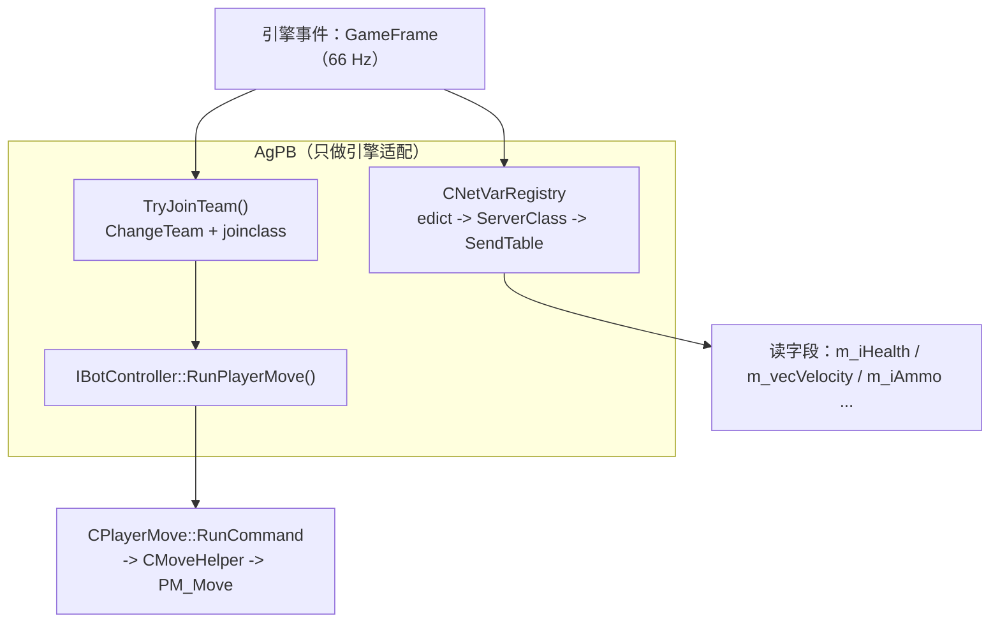

# AgPB 项目归档

> AgPB —— Counter-Strike: Source（Source 1 / Win64）的 agent 控制 bot 插件
> 归档时间：2026-09-19
> 状态：**M2.5 完成** —— 包括「ucmd 注入真的驱动玩家」这条关键验证
> M1 / M2 / M2.5 全部实测通过；下一步 M3：EBot 移植（`Engine` → `Client` → `waypoint` → `control`/`navigate`/`combat`）
> **收工交接见 → §10**（已实测结论清单 / 数字基线 / 明天从哪开始）

---

## 1. 目标

写一个 Metamod:Source 插件，创建**完全由外部 agent（LLM）控制**的 bot：

- 不使用 SourceMod
- 不使用引擎自带的 `CCSBot` / `CCSBotManager`
- agent 只出高层意图，逐 tick 的 `CUserCmd` 由插件内的原生反射层生成

---

## 2. 环境

```
E:\Plugins-Platform\
├─ hl2sdk-css\                 # CS:S SDK（内含完整引擎源码 source-engine-czero\）
├─ hl2sdk-manifests\           # css.json + SdkHelpers.ambuild
├─ metamod-source\             # Metamod:Source 2.0.0-Rel (CNSR-nillerusr-x64)
├─ sourcemod\                  # 未使用，仅作参考
├─ refs\CS-EBOT\               # EBot 参考源码（clone 自 EfeDursun125/CS-EBOT）
└─ AgPB\                       # 本插件
```

| 项 | 值 |
|---|---|
| 目标架构 | Windows x86_64（manifest 里 `platforms.windows` 只声明了 `x86_64`） |
| 构建系统 | AMBuild 2.2（`ambuild`） |
| 编译器 | MSVC 19.44，x64 |
| SDK 静态库 | `hl2sdk-css\source-engine-czero\build\{tier0,vstdlib,mathlib,tier1}\*.lib` |
| 关键编译选项 | `/utf-8`（源码含中文注释）、`/MT`、`_ALLOW_KEYWORD_MACROS` |

**注意**：`SdkHelpers.configureCxx()`（`hl2sdk-manifests/SdkHelpers.ambuild:243`）会把 manifest 里那几个 `.lib` 加到**任何**基于 css SDK 的二进制上——包括 Metamod:Source 自身。所以这几个库是平台级前提，不打出来 MMS 也编不过。

---

## 3. 核心发现（决定整个设计）

### 3.1 `BotManager001`：官方暴露的"无 AI 假客户端"接口

`game/server/playerinfomanager.cpp:133`：

```cpp
EXPOSE_SINGLE_INTERFACE_GLOBALVAR(CPluginBotManager, IBotManager,
                                  INTERFACEVERSION_PLAYERBOTMANAGER, s_BotManager);
```

`INTERFACEVERSION_PLAYERBOTMANAGER` = `"BotManager001"`（`public/game/server/iplayerinfo.h:186`）。

```cpp
edict_t *CPluginBotManager::CreateBot( const char *botname )
{
    edict_t *pEdict = engine->CreateFakeClient( botname );
    CBasePlayer *pPlayer = ((CBasePlayer*)CBaseEntity::Instance( pEdict ));
    pPlayer->ClearFlags();
    pPlayer->AddFlag( FL_CLIENT | FL_FAKECLIENT );
    pPlayer->ChangeTeam( TEAM_UNASSIGNED );
    pPlayer->RemoveAllItems( true );
    pPlayer->Spawn();
    return pEdict;
}
```

**它不创建 `CCSBot`**，所以引擎自带的 bot AI 完全不会介入。

拿到 `IBotController`（实现在 `CPlayerInfo`）后，`RunPlayerMove(CBotCmd*)` 走的是和引擎自己一样的那条路：

```cpp
void CPlayerInfo::RunPlayerMove( CBotCmd *ucmd )
{
    ...
    MoveHelperServer()->SetHost( m_pParent );
    m_pParent->PlayerRunCommand( &cmd, MoveHelperServer() );
    ...
}
```

对照 `CBasePlayer::PhysicsSimulate()`（`player.cpp:3362`）——**完全同一条路径**。

**收益**：不需要特征码扫描、不需要硬编码偏移、不需要链接 `server.dll`。插件只依赖公开虚接口，编译只需要 SDK 头文件。

**取工厂的方式**（`plugin.cpp`）：

```cpp
g_Bots.Init( ctx, ismm->GetServerFactory( false ) );   // false = 真正的 server.dll 工厂
// 内部：
m_Ctx.pBotManager = (IBotManager *)pServerFactory( INTERFACEVERSION_PLAYERBOTMANAGER, NULL );
```

### 3.2 `IVEngineServer::ClientCommand()` 是 stuffcmd —— 假客户端收不到

`engine/vengineserver_impl.cpp:1006`：

```cpp
virtual void ClientCommand(edict_t* pEdict, const char* szFmt, ...)
{
    ...
    NET_StringCmd string( szOut );
    sv.GetClient(entnum-1)->SendNetMsg( string );   // ← 发给"客户端控制台"
}
```

它把命令塞进**客户端**的控制台回显队列，靠真实客户端再回传。假客户端没有 netchannel，命令直接蒸发。

**症状**：bot 一直留在观察者列表里，`jointeam` 从来没生效过。

**正确做法**：`IServerPluginHelpers::ClientCommand`

```
IServerPluginHelpers::ClientCommand
  → CServerPlugin::ClientCommand(edict, cmd)        // sv_plugin.cpp:648
  → sv.GetClient(entnum-1)->ExecuteStringCommand()  // 服务端本地执行，不经网络
  → CGameClient::ExecuteStringCommand
  → serverGameClients->ClientCommand(...)           // CCSPlayer::ClientCommand
```

前提是 `ismm->EnableVSPListener()` 已经打开。

**记忆点**：需要"服务端本地"执行的用 `helpers->ClientCommand`；`engine->ClientCommand` 永远不要用。

### 3.3 入队和出生是两件事

**入队**：用 `IPlayerInfo::ChangeTeam(team)` 直通 `CCSPlayer::ChangeTeam()`，绕开命令通道和限流。

```cpp
// 绝对不要用 IVEngineServer::ClientCommand()，见 3.2
m_pInfo->ChangeTeam( m_iTeam );

// 兜底：若该队号没有对应 CTeam 对象，ChangeTeam 会打印
// "invalid team index" 并直接返回，这时改走命令通道
if ( m_pInfo->GetTeamIndex() != m_iTeam ) { ...spectate / jointeam... }
```

**出生**：`CCSGameRules::FPlayerCanRespawn()` 才是闸门：

```cpp
// Player cannot respawn twice in a round
if ( pPlayer->m_iNumSpawns > 0 && m_bFirstConnected )   return false;
// 回合重启前不刷人
if ( gpGlobals->curtime < m_flRestartRoundTime )        return false;
// 只有 T/CT 能出生
if ( pPlayer->GetTeamNumber() != TEAM_CT &&
     pPlayer->GetTeamNumber() != TEAM_TERRORIST )       return false;
// 必须有合法 class           ← 这就是必须补 joinclass 的原因
if ( pPlayer->GetClass() == CS_CLASS_NONE )             return false;
```

`CCSPlayer::ChangeTeam()` 的 active-player 分支只做 `State_Transition( STATE_PICKINGCLASS )`，
`m_iClass` 还是 `CS_CLASS_NONE`。所以入队成功后**必须再发一次 `joinclass 0`**：

```cpp
if ( iCurTeam == m_iTeam ) {
    if ( ( m_iTeam == T || m_iTeam == CT ) && !m_bClassRequested ) {
        m_bClassRequested = true;
        RunClientCommand( m_Ctx.pHelpers, m_pEdict, "joinclass 0" );
    }
    return;
}
```

**队伍编号**（`game/shared/cstrike/cs_shareddefs.h:108-110`）：`0 = 未分配`（HUD 里也算"观察者"）、`1 = 观察者`、`2 = T`、`3 = CT`。

**操作建议**：加完 bot 后 `mp_restartgame 1`，回合重启时会正常出生。

### 3.4 netvar 反射可行（EBot 移植的地基）

> **路线更新（M2 已落地）**：datamap 需要虚调用 `GetDataDescMap()`，而它在公开头文件里
> 没有编译期可知的 vtable 索引 —— SourceMod 自己也是从 gamedata 取偏移
> （`core/smn_entities.cpp:246`）。所以最终改走 **SendTable 路径**：
> 整条链路都是编译器解析的成员访问 / 虚调用，**零硬编码索引、零特征码**。
> 详见 §4 的「M2 新增：SendTable 反射层」小节。下面这段 datamap 分析保留为背景资料。

#### 3.4.1 datamap 路径（备选，未采用）

`public/datamap.h:325`：

```cpp
virtual datamap_t *GetDataDescMap( void );
```

**是虚函数**。继承链是单链（`baseentity.h:348`、`iserverentity.h:29`、`iserverunknown.h:25`）：

```
CBaseEntity : IServerEntity : IServerUnknown : IHandleEntity
```

所以可以：

```
IServerGameEnts::EdictToBaseEntity(edict)   // "ServerGameEnts001"，eiface.h:671
   → CBaseEntity*
   → vtable 调 GetDataDescMap()  → datamap_t 链
   → 遍历 typedescription_t 建 name → fieldOffset 表
   → 按名字读 m_vecVelocity / m_iAmmo / m_iAccount ...
```

**不需要特征码扫描，跨引擎版本稳定。** manifest 的 include 路径里已经带了
`source-engine-czero/game/server` 和 `game/shared`，`datamap.h` 直接可用。

顺带：因为单继承链地址一致，`EdictToBaseEntity()` 的返回值可以直接当 `IHandleEntity*` 用。
这也是 trace filter 里"跳过自己"的正确做法——`ShouldHitEntity()` 收到的
`IHandleEntity*` 与 `CBaseEntity*` 同地址，直接比较指针即可。

---

## 4. 当前代码

```
AgPB/
├─ AMBuildScript          # AMBuild 2.2（由 s2_sample_mm 改造，删掉 Source2-only 断言）
├─ configure.py
├─ AMBuilder              # 产出 agpb_mm.dll
├─ plugin-metadata.json
├─ ARCHIVE.md             # 本文档（设计与踩坑）
├─ README.md              # 快速上手
├─ VERIFY.md              # 三阶段验证清单
├─ LICENSE                # GPL-3.0
├─ addons/metamod/AgPB.vdf
└─ src/
   ├─ plugin.h / plugin.cpp     # MMS 入口、GameFrame 钩子、控制台命令
   ├─ bot.h    / bot.cpp        # 假客户端生命周期、队伍切换、命令链驱动、netvar 取值
   └─ netvars.h / netvars.cpp   # M2：SendTable 反射层（字段名 → 偏移 → 读值）
```

规模：**6 个文件 / 1973 行 / 约 59.5 KB**，产物 `agpb_mm.dll` ≈ **388 KB**（397,312 字节）。

> 编译告警：`/W3` 下插件代码自身 **0 warning**；但 `cl` 命令行会多报一条
> `warning D9025: 正在重写 "/Zi"(用 "/Z7")`，来自 manifest 的默认 flags，无害。

---

### M2 新增：SendTable 反射层（`netvars.h` / `netvars.cpp`）

#### 访问链（全部编译器解析，无索引常量）

```
edict_t* pEdict
  -> pEdict->GetNetworkable()          // edict.h:174  内联，直接 m_pUnk->GetNetworkable()
  -> IServerNetworkable* pNet
  -> pNet->GetServerClass()            // iservernetworkable.h:94  虚调用
  -> ServerClass* pClass               // server_class.h:27
  -> pClass->m_pTable                  // 数据成员，无虚调用
  -> SendTable* pTable                 // dt_send.h:438
  -> pTable->m_pProps[i]               // SendProp，dt_send.h:186
```

再对每个 `SendProp` 取 `GetOffset() / GetType() / GetNumElements() / GetElementStride()`，
就得到 `名字 → 相对实体对象基址的字节偏移 → 类型` 的完整映射。

#### 递归展开（关键证据）

`dt_send.h:553`：

```cpp
SendPropDataTable( "baseclass", 0, className::BaseClass::m_pClassSendTable, SendProxy_DataTableToDataTable ),
```

基类表以 **`"baseclass"` + offset 0** 挂在派生表里，嵌套成员子表带真实偏移。
所以统一用 `offset += pProp->GetOffset()` 递归即可，不需要区分「基类」和「成员子表」。

#### 坑：Source 有**两套完全不同的数组机制**（M2 实测踩中）

第一版实现里 `m_iAmmo`、`pl.v_angle` 都搜不到，而且 `props=652` 明显虚高。根因是两个 bug 叠加。

**机制 A —— `SendPropArray` / `SendPropVariableLengthArray`**（例：`m_hViewModel`，`player.cpp:8010`）

宏展开成**两个连续属性**：

```cpp
SendPropEHandle( SENDINFO_ARRAY( m_hViewModel ) ),   // 下标 i-1：元素模板，名字也叫 "m_hViewModel"
InternalSendPropArray( ... )                          // 下标 i  ：m_Type = DPT_Array
```

引擎在 `SetupArrayProps_R`（`engine/dt.h:501-511`）里给**元素模板**打 `SPROP_INSIDEARRAY`，
再把数组属性的 `m_pArrayProp` 指回元素模板。

- 元素模板的名字和数组**完全一样**（都来自 `SENDINFO_ARRAY`）→ 必须跳过，否则列表里出现重复条目，
  而且 `Find()` 会**先撞上元素**，拿到的是标量类型而不是 `DPT_Array`。
- **判据只能是 `IsInsideArray()` 本身**：`SendProp::GetParentArrayPropName()` 在整个 Source 1
  里**从来没被调用过**（只有 `dt_recv.cpp:417` 给 RecvProp 设过），永远返回 NULL。
  第一版写了 `IsInsideArray() && GetParentArrayPropName() != NULL`，等于没过滤。
- **数组属性的 `m_Offset` 永远是 0！** `InternalSendPropArray`（`dt_send.cpp:480`）从头到尾
  没碰过 `m_Offset`（只设了 `m_nElements` / `m_ElementStride` / `m_pVarName`）。
  真实偏移只存在于**元素模板**上。第二版错用了数组属性的 offset，于是读到 `base+0`，
  即实体的 vtable 指针（实测输出 `m_hViewModel +0`，元素 `[0] = 1427261664`）。

**权威参考实现**是引擎自己的 `Array_Encode`（`engine/dt_encode.cpp:950`）：

```cpp
SendProp *pArrayProp = pProp->GetArrayProp();
unsigned char *pCurStructOffset = (unsigned char*)pStruct + pArrayProp->GetOffset();  // ← 元素模板的偏移
for ( int iElement = 0; iElement < nElements; iElement++ )
{
	pArrayProp->GetProxyFn()( pArrayProp, pStruct, pCurStructOffset, &var, iElement, objectID );
	pCurStructOffset += pProp->GetElementStride();                                    // ← 数组属性的 stride
}
```

即「**基址用元素模板的 offset，步长用数组属性的 stride**」。照着写，读写地址就和引擎
编码时用的是同一个表达式，正确性由构造保证。

- 元素类型也从 `pProp->GetArrayProp()->GetType()` 取。

> **顺带的教训：运行时 SendTable 才是权威，编译期的 `sizeof` 不可信。**
> `m_hViewModel` 运行时 stride 是 **8**，而 `PROPSIZEOF` / `sizeof(CHandle<CBaseViewModel>)`
> 推出来应该是 4。不管这个差异从哪来（宏链、历史声明、打包差异），
> 引擎自己用哪个值寻址，我们就用哪个值。

**机制 B —— `SendPropArray3`**（例：`m_iAmmo`，`player.cpp:7945`）

`public/dt_send.cpp:691` 看完才知道它不是数组：

```cpp
ret.m_Type = DPT_DataTable;                        // ← 不是 DPT_Array
ret.m_pVarName = pVarName;                         // "m_iAmmo"
pProps[i].SetOffset( i*sizeofVar );                // 相对数组起点的偏移
pProps[i].m_pVarName = s_ElementNames[i];          // "000".."031"
pProps[i].m_pParentArrayPropName = pVarName;
ret.SetDataTable( new SendTable( pProps, elements, pVarName ) );   // 子表名 == 属性名
```

- 天真的子表递归会吐出 32 个叫 `"000"`..`"031"` 的匿名标量，**数组名彻底丢失**。
  （这同时解释了 `props=652` 虚高：`m_iAmmo` 32 条、`m_bPlayerDominated` 等 `CNetworkArray` 各 33 条……）
- 必须识别并**折叠成一个 `DPT_Array` 条目**。判据（两道保险）：
  1. 子表名 == 属性名 —— 真实 `DT_*` 表名永远带 `DT_` 前缀，不会撞；
  2. 子表第一个元素的 `m_pParentArrayPropName != NULL`（`dt_send.cpp:726` 才会填）。
- 步长 = `元素[1].offset - 元素[0].offset`（`SendPropArray3` 按 `i*sizeofVar` 排布）。
- 元素类型直接取子表第一个元素的类型。

**机制 C —— `m_iAmmo` 挂在哪**：它属于 `DT_LocalPlayerExclusive`，
由 `SendPropDataTable( "localdata", 0, &DT_LocalPlayerExclusive, SendProxy_SendLocalDataTable )`
（`player.cpp:8018`）挂进 `DT_BasePlayer`。属性名是 `localdata`、表名是 `DT_LocalPlayerExclusive`，
所以判定「合成数组表」时不能只看名字，必须配合第 2 条判据。

> offset 0 + `SendProxy_SendLocalDataTable` 只是决定「只发给本人」，
> **不影响内存布局**，所以 `offset += GetOffset()` 递归依然正确。

#### 另一个细节：负偏移

引擎用**负偏移**标记 `SENDPROP_VECTORELEM`（`dt_send.h:597` 的 `SENDINFO_VECTORELEM`，
`engine/dt_send_eng.cpp:732` 里 `SendTable_CalcNextVectorElems()` 取绝对值修正）。
插件在游戏 DLL 初始化之后加载，此时已修正；仍做一次防御性 `abs()`。

顺带跳过 `IsExcludeProp()`（只用于下发、不出现在实体内存里的属性）。

#### 坑：int 字段的宽度只存在于 proxy 里

实测中 `m_lifeState` 读出来是 **512**，而它应该是 `0`（`LIFE_ALIVE`）。
两个事实叠在一起：

1. **SendTable 里拿不到字段宽度。** `SetElementStride` 在整个 `dt_send.cpp` 里
   **一次都没被调用过**，标量的 `m_ElementStride` 永远是 `SIZEOF_IGNORE(-1)`
   （实测输出里的 `s=-1` 就是这个）。
2. `m_lifeState` 实际上只有 **1 字节**（`game/client/c_baseentity.h:1353` 是 `char`），
   按 4 字节读会把邻字段（值 2）也读进来 → `0x00000200 = 512`。

**修法：int 一律走引擎自己的 proxy。** `SendPropInt` 是根据 `sizeofVar` 选 proxy 的
（`1 → SendProxy_Int8ToInt32`，`2 → Int16`，`4 → Int32`，`dt_send.cpp:730` 附近），
所以 proxy 才是宽度的唯一真相；而且调用它 = 引擎编码时走的同一条路。

```cpp
DVariant out; out.m_Int = 0;
NetVar_CallProxy( nv, pBase, iElement, 0, &out );   // 调 nv.pProp->GetProxyFn()
return out.m_Int;
```

调用时 `pData` 用 `nv.offset`（Walk 已算成绝对偏移）而**不是** `pProp->GetOffset()`：
`SendPropArray3` 的合成元素偏移是相对数组起点的（0, 4, 8…），直接用会错。

float / vec3 仍是直接内存读（宽度无歧义 4 / 12 字节），顺便避开
`SendProxy_Origin` 这类会**改数值**的代理。

### M2.5 实测结果：ucmd 注入真的驱动了玩家（2026-09-19）

```
agpb_testmove 0 400 90     // forwardmove=400, viewangles.y=90
  m_vecVelocity[0] = -0.0000
  m_vecVelocity[1] = 250.0000     <-- yaw=90 即 +Y 方向，而 250 正好是 USP 跑速上限
  m_vecVelocity[2] =  0.0000
  m_angEyeAngles[1] = 90.0000     <-- 我给的 yaw 原样出现在视角字段里
```

方向、大小、速度上限**三个都对**。这一条验证了整条链路：

```
Think() -> IBotController::RunPlayerMove() -> CPlayerMove::RunCommand -> PM_Move
```

**两个结论：**

1. `RunPlayerMove` 真的驱动玩家 —— 整个架构的前提成立，M3 的 control/navigate 有落脚点。
2. **假客户端的视角会跟随 `CUserCmd`** —— `m_angEyeAngles[0]/[1]`（+6984/+6988）
   就是可靠的当前朝向来源，EBot 的 `IsInViewCone` 直接用，不需要另找出路。

（这条如果不成立，M5 的视野锥判定就得多一层情报不确定，所以早验早好。）

#### 实测验证结果（2026-09-19）

| 项 | 修复前 | 修复后 |
|---|---|---|
| `props=` | 652（虚高） | **268** |
| `m_iAmmo` | 找不到（只剩 32 个匿名 `"000"`..`"031"`） | `+2136 array [32 x 4] elem=int` |

`m_iTeamNum` 读回 `3`（CT，与 `agpb_list` 一致），
`m_iAmmo` 元素 `[8] = 100`，而这个 bot 手里拿的是 **USP（12/100）**，
即 8 号弹药 = 9mm、备弹 100 发 —— **数值与游戏内完全对得上**。

这是最硬的验证：值不是猜的，而是引擎 `SendProp::GetOffset()` 给出的地址上
真实躺着的数字（`offset = 2136` 是引擎自己算的）。

#### EHANDLE（`CBaseHandle`）—— M3 武器系统的前置条件

**这个 x64 移植版里 `CBaseHandle` 是 8 字节**：`basehandle.h:66` 的成员是 `uintp m_Index`
（不是 `unsigned long`）。读 EHandle 字段**必须读 8 字节**。

打包规则（`basehandle.h:98`）：

```
m_Index = entry | (serial << NUM_ENT_ENTRY_BITS)
NUM_ENT_ENTRY_BITS = MAX_EDICT_BITS + 1 = 12      (const.h:68 / const.h:78)
ENT_ENTRY_MASK = 0xFFF,   MAX_EDICTS = 2048
```

**实例（`m_hViewModel` 的两个元素）**：

```
0x068AB05F -> entry = 95, serial = 26795
0x0639605E -> entry = 94, serial = 25494
```

两个**连续的实体索引**，正是两个 viewmodel 实体。
（一开始它们看着像垃圾值 `109752415` / `104423518`，只是因为我把打包过的句柄
当普通 int 打印了；地址从始至终都是对的。）

**句柄 → edict 的解析路径（完全不碰引擎内部）**：

```cpp
entry  = h & ENT_ENTRY_MASK;                                    // 低 12 位
pEdict = engine->PEntityOfEntIndex( entry );                    // eiface.h:143
校验    pEdict->GetNetworkable()->GetEntityHandle()
           ->GetRefEHandle().ToInt() == (int)h                  // ihandleentity.h:23
```

**用整值比对，不要拿 `serial` 去比。** 实测：句柄 `0x02FC304C` 解出 entry=76，
`EdictIndex` 也确实是 76（印证了低 12 位就是条目号），但
`edict_t::m_NetworkSerialNumber` 是 **963**，而句柄里的 serial 是 **12227** —— 口径不同，
扫完 2048 个 edict 也是 0 命中。

`IHandleEntity::GetRefEHandle()`（`public/ihandleentity.h:23`）是**公开接口**，
`IServerNetworkable::GetEntityHandle()`（`iservernetworkable.h:91`）能拿到它，
所以既不需要 `CBaseHandle::Get()`（那个要 `g_pEntityList` 全局，只能靠特征码），
也不需要猜 serial 的口径 —— 引擎为哪个实体维护什么句柄，就拿那个句柄比。

**实测已通过（2026-09-19）**：

```
agpb_nethandle 0 m_hActiveWeapon
  offset=+2648 type=0 elems=1 stride=-1
  raw=0x0000000002C42061
  entry=97 serial=11330 resolved=yes class=CWeaponUSP
```

（顺带一个命名事实：CS:S 里这把枪的 ServerClass 是 `CWeaponUSP`，不是 `CWeaponUSP45`。）

> `m_EdictIndex` / `m_NetworkSerialNumber` 依旧是 **`CBaseEdict` 的公开成员**
> （`edict.h:219-223`），打在诊断里做参照仍然有用。

#### netvar 公开接口

```cpp
struct BotNetVar {
    const char  *name;       // 指向引擎内部常量串，进程生命周期内有效，不必拷贝
    int          offset;     // 相对实体对象基址
    SendPropType type;       // DPT_Int / DPT_Float / DPT_Vector / DPT_String / DPT_Array ...
    SendPropType elementType;// 数组元素类型；非数组时等于 type
    int          elements;   // 数组元素个数
    int          stride;     // 数组元素间距（不能假设等于 sizeof(int)）
    const char  *parentArray; // 保留字段；折叠后恒为 NULL
};

class CNetVarTable {          // 单个 ServerClass 的扁平字段表
    bool Build( ServerClass *pClass );
    int  Count() const;
    const BotNetVar &Prop( int index ) const;
    const BotNetVar *Find( const char *name ) const;   // 线性扫描，约 300 条
    const char *ClassName() const;
};

class CNetVarRegistry {       // 按 ServerClass 缓存；SendTable 静态构建，无需失效逻辑
    const CNetVarTable *GetForEdict( edict_t *pEdict );
    const CNetVarTable *GetForClass( ServerClass *pClass );
};
```

读取辅助（内联，无边界检查 —— 调用方保证名字正确）：

```cpp
NetVar_GetInt / GetBool / GetFloat / GetVector / GetString( pBase, nv )
NetVar_GetArrayInt / NetVar_GetArrayFloat( pBase, nv, index )   // base + offset + stride * index
```

实体基址：`pEdict->GetUnknown()->GetBaseEntity()`（`iserverunknown.h:31`），
公开头文件里 `CBaseEntity` 只有前置声明，所以当不透明指针用。

`CAgPB` 上的便捷封装（名字查表 + 类型检查，失败返回默认值）：

```cpp
void *NetVarBase() const;
const CNetVarTable *NetVarTable() const;
const BotNetVar *FindNetVar( const char *name ) const;
bool   GetNetVarBool  ( const char *name, bool   def = false ) const;
int    GetNetVarInt   ( const char *name, int    def = 0 ) const;
float  GetNetVarFloat ( const char *name, float  def = 0.0f ) const;
Vector GetNetVarVector( const char *name ) const;
int    GetNetVarArrayInt( const char *name, int index, int def = 0 ) const;
```

#### 限制

SendTable 只覆盖**网络字段**。CS:S 里绝大多数需要的量（`m_iHealth`、`m_iTeamNum`、`m_vecVelocity`、`m_lifeState`、`m_iAmmo`、`m_iAccount`、`m_flNextAttack` …）都是网络字段，够用；
少数纯服务端的非网络字段以后若需要，再补 datamap 路径。（`m_flNextAttack` **在网络表里**，实测 +2044，见 §10 数字基线 —— 不要拿它当反例。）

### 分层



`Think()` **刻意不生成任何有意义的输入**（只有 `agpb_testmove` 这个临时开关会写
`forwardmove` / `viewangles.y`）：移动 / 瞄准 / 战斗将由移植过来的
EBot `control` / `navigate` / `combat` 模块填充。这里只保证引擎需要的调用链被驱动
（即使 bot 死亡/未出生也必须每 tick 调一次 `RunPlayerMove`，否则武器逻辑、动画与
`PostThink` 都不会跑）。

### 公开接口

```cpp
struct BotEngineContext {
    IBotManager         *pBotManager;        // "BotManager001"
    IVEngineServer      *pEngine;
    IPlayerInfoManager  *pPlayerInfoManager;
    IServerPluginHelpers *pHelpers;          // 唯一能对假客户端本地执行命令的接口
    IEngineTrace        *pTrace;             // ← EBot 移植入口（目前未读取）
    IServerGameEnts     *pGameEnts;          // ← EBot 移植入口（目前未读取）
    bool IsReady() const;
};

class CAgPB {
    bool Create( const BotEngineContext &ctx, const char *name, int team, char *error, size_t maxlen );
    void Destroy();
    void Think( CGlobalVars *pGlobals );
    bool SetTeam( int team );       // 1=观察者 2=T 3=CT
    edict_t *Edict();
    const char *Name();
    int  Index();                   // edict index
    int  DesiredTeam();
    IPlayerInfo *PlayerInfo();

    // M2 netvar 反射（详见上文「M2 新增」小节）
    void *NetVarBase() const;
    const CNetVarTable *NetVarTable() const;
    const BotNetVar *FindNetVar( const char *name ) const;
    bool   GetNetVarBool  ( const char *name, bool  def = false ) const;
    int    GetNetVarInt   ( const char *name, int   def = 0 ) const;
    float  GetNetVarFloat ( const char *name, float def = 0.0f ) const;
    Vector GetNetVarVector( const char *name ) const;
    int    GetNetVarArrayInt  ( const char *name, int index, int   def = 0 ) const;
    float  GetNetVarArrayFloat( const char *name, int index, float def = 0.0f ) const;

    // EHANDLE（8 字节 CBaseHandle）
    bool GetNetVarHandleValue( const char *name, uintp *pHandle ) const;   // 原始整值
    bool GetNetVarHandle( const char *name, int *pEntry, int *pSerial ) const;
    edict_t *HandleToEdict( uintp handle ) const;                          // 传整值，不是 entry/serial

    // 【临时】ucmd 注入验证；M3 移植的 control 模块会取代
    void SetTestInput( float forward, float yaw );
};
```

`pTrace` / `pGameEnts` 目前没有读取者，但它们是移植的入口（实体句柄转换 + 视线判定），
所以先留在 context 里。

### 控制台命令

| 命令 | 说明 |
|---|---|
| `agpb_add [team]` | 创建 bot（1=观察者 2=T 3=CT） |
| `agpb_team <idx> <team>` | 运行时切换队伍 |
| `agpb_list` | 列出所有 bot（实际队伍 / 目标队伍 / 血量 / 武器 / 坐标） |
| `agpb_kick <idx\|all>` | 移除 bot |
| `agpb_netlist <idx> [filter]` | 展开该 bot 的 SendTable 字段表（字段名 / 偏移 / 当前值），M2 的验证工具 |
| `agpb_nethandle <idx> <field>` | 把 EHANDLE 字段解包并解析回实体（打印 entry / serial / class） |
| `agpb_testmove <idx> <fwd> [yaw]` | **【临时】** 把 `forwardmove` / `viewangles.y` 写进下一条 `CUserCmd`，验证 ucmd 注入链路 |

ConVar：`agpb_enable`（默认 1）、`agpb_team`（默认 2）。

---

## 5. 构建与部署

### 构建

```powershell
cd E:\Plugins-Platform\AgPB
mkdir build
cd build
cmd /c '"E:\vs\VC\Auxiliary\Build\vcvarsall.bat" amd64 && chcp 65001 && set PYTHONIOENCODING=utf-8 && py ../configure.py -s css --targets x86_64 --enable-optimize && ambuild'
```

产物：`build\agpb_mm\windows-x86_64\agpb_mm.dll`

### 部署（x64 子目录约定）

```
cstrike/addons/AgPB/bin/win64/agpb_mm.dll
cstrike/addons/metamod/AgPB.vdf
```

`AgPB.vdf`：

```
"Metamod Plugin"
{
	"alias"		"AgPB"
	"file"		"addons/AgPB/bin/win64/agpb_mm"
}
```

> 这个 `win64` 子目录约定与 MMS 自身的打包布局一致
> （MMS 的 x64 包就是 `addons/metamod/bin/win64/server.dll`）。

启动后控制台出现下面这行即部署成功：

```
[AgPB] loaded. gpGlobals=..., IBotManager=..., helpers=...
```

### 验收

```
agpb_kick all
agpb_add 3              // 3 = CT；不带参数时用 agpb_team 的默认值 2（T）
mp_restartgame 1        // 关键：回合重启时才会出生
agpb_list
```

期望：控制台出现 `[AgPB] 1 bot(s), IBotManager=ok, helpers=ok`，
列表里 `[0]` 为 `team=3 want=3 hp=100`。

然后验证反射层：

```
agpb_netlist 0 m_iHealth
agpb_netlist 0 m_iAmmo
agpb_netlist 0 m_angEyeAngles      // 负偏移 / VECTORELEM
agpb_netlist 0 m_vecVelocity       // 负偏移 / VECTORELEM
agpb_netlist 0 m_hViewModel        // 真 DPT_Array
```

已实测输出（2026-09-19，修复数组展开之后）：

```
[AgPB] AgPB_01 class=CCSPlayer props=268 base=0x... filter=m_iHealth
  m_iHealth                        +364   int    = 100

[AgPB] AgPB_01 class=CCSPlayer props=268 base=0x... filter=m_iAmmo
  m_iAmmo                          +2136  array  [32 x 4] elem=int
      [ 8] = 100
      ... 其余为 0

[AgPB] ... filter=m_angEyeAngles          // 负偏移 / VECTORELEM
  m_angEyeAngles[0]                +6984  float  = 0.0000
  m_angEyeAngles[1]                +6988  float  = 0.0000

[AgPB] ... filter=m_vecVelocity           // 负偏移 / VECTORELEM
  m_vecVelocity[0]                 +888   float  = 0.0000
  m_vecVelocity[1]                 +892   float  = 0.0000
  m_vecVelocity[2]                 +896   float  = 0.0000
```

**偏移是引擎给的，不是猜的**：血量与游戏内显示一致、弹药与 bot 手里的
USP（12/100）完全对得上，就说明 `baseclass` 递归累加偏移这条链路是对的。

视角与速度当时都是 0，与现状自洽（`Think()` 下发的是 `cmd.Reset()`，角度和位移本来就是 0）。
**已在 M2.5 用非零值重测通过** —— 见下文「M2.5 实测结果」。

> 修复前 `props=652`（虚高），`m_iAmmo` 搜不到。原因见 §4 的「坑：两套数组机制」。

---

## 6. 踩过的坑（重要，别再踩）

| 坑 | 现象 | 解决 |
|---|---|---|
| `AMBuildScript` 被 AMBuild 用 locale(GBK) 解码 | `UnicodeDecodeError` | **构建脚本里一个非 ASCII 字符都不能有** |
| MSVC 默认按 936 读源码 | 中文注释导致 `error C2001: 常量中有换行符` | 编译加 **`/utf-8`** |
| SRCDS 控制台是 GBK | 中文日志乱码 | 所有**输出字符串用英文**，注释可以中文 |
| `IVEngineServer::ServerCommand()` 不是变参 | `error C2660: 函数不接受 2 个参数` | 先 `snprintf` 再传 |
| `s2_sample_mm/AMBuildScript` | `Only Source2 games are supported` 断言 | 删掉该断言 |
| `chcp` 没设 + `PYTHONIOENCODING` 没设 | `ambuild` 打印 `cl` 输出时 `UnicodeEncodeError` 崩溃 | 都设上 |
| SDK 静态库不存在 | `LNK1181: 无法打开输入文件 tier0.lib` | 先用 `waf` 构建 `source-engine-czero` |
| **编辑工具写坏文件** | 多行替换含中文注释 / `%` / `(` / `\"` 时，文件被截断或函数被塞进别的函数体里 | **改这几个文件一律整文件重建**（`Remove-Item` + `create_file`） |

---

## 7. EBot 移植计划

### 参考实现血统

**POD-Bot → YaPB → SyPB（`CCNHsK-Dev/SyPB`，GPL-3.0）→ CS-EBOT（`EfeDursun125/CS-EBOT`，MPL-2.0）**

已 clone 到 `E:\Plugins-Platform\refs\CS-EBOT`。

| 文件 | 职责 | 移植难度 |
|---|---|---|
| `source/engine.cpp` + `include/engine.h` | **引擎适配层**（`Entity` / `Client` / `Engine`） | **整体重写** |
| `source/combat.cpp` | 敌友扫描、开火、武器选择 | 小改 |
| `source/control.cpp` | 移动控制 | 小改 |
| `source/navigate.cpp` | 路径跟随 | 小改 |
| `source/waypoint.cpp` | 路点图 + 距离矩阵 | 文件 IO 改一下 |
| `source/basecode.cpp` | `IsEnemyReachable` 等 | 小改 |
| `source/support.cpp` | `IsVisible` / `IsInViewCone` | 小改 |
| `source/ssm/` | 战斗状态机（投雷 / 致盲 / 破门） | 基本原样 |

### 唯一需要重写的接缝

`include/engine.h` 里只有三个类在做引擎适配：

```cpp
class Entity                              // line 2352
class Client : public Entity              // line 2772
class Engine : public Singleton<Engine>   // line 2908
```

它连 GoldSrc 的 `struct edict_s` 都是自己重新定义的（line 1681）。

```
EBot 原样保留：combat / control / navigate / waypoint / basecode / ssm
        ↓ 只依赖
重写：Entity / Client / Engine   ← datamap 反射 + IEngineTrace + BotManager001
        ↓
Source 引擎
```

### 核心参考设计：`Bot::FindFriendsAndEnemiens()`

每帧全量扫描，结论全部缓存进 bot 结构：

```cpp
void Bot::FindFriendsAndEnemiens(void)
{
    m_hasEnemiesNear = false;
    m_enemyDistance = 999999.0f;
    ...
    for (const Clients& client : g_clients)
    {
        if (client.team == m_team)          // ← 敌我识别就这一行
        {
            TraceLine(myOrigin, client.ent->v.origin + client.ent->v.view_ofs,
                      TraceIgnore::Everything, GetEntity(), &tr);
            if (tr.flFraction < 1.0f) continue;
            m_nearestFriend = client.ent;  m_hasFriendsNear = true;
        }
        else
        {
            m_numEnemiesLeft++;
            distance = GetDistance(myWaypoint, client.wp);   // ← 路径距离，不是直线
            if (distance < m_enemyDistance && !IsEnemyInvincible(client.ent) &&
                !IsEnemyHidden(client.ent) && CheckVisibility(client.ent))
            {
                m_enemyDistance   = distance;
                m_nearestEnemy    = client.ent;
                m_hasEnemiesNear  = true;
            }
        }
    }
    if (m_hasEnemiesNear) m_enemySeeTime = engine->GetTime();   // ← 敌人记忆
}
```

可见性判定（`support.cpp:112`）：

```cpp
bool IsVisible(const Vector& origin, edict_t* ent)
{
    TraceResult tr;
    TraceLine(GetEntityOrigin(ent), origin, TraceIgnore::Everything, ent, &tr);
    return (tr.flFraction >= 1.0f);
}
```

**三个必须照抄的设计决策**：
1. 敌我是**队伍比较**，不是推理；
2. 结果**缓存**，其它模块只读；
3. 选最近敌人用 **waypoint 距离矩阵（路径距离）**，避免"墙后直线更近"的误判。

### M3 起步调研（2026-09-19）

#### 不要移植 `include/engine.h`

那 95 KB 里绝大部分是 **GoldSrc 类型定义 + Metamod 1.x 兼容层**，在 MMS 2.0 下全部作废：

| 里面的东西 | 处理 |
|---|---|
| `meta_globals_t` / `DLL_FUNCTIONS` / `plugin_info_t` / `hudtextparms_t` / `meta_interface` | **直接删除**，MMS 2.0 的 `ISmmPlugin` 早就不需要 |
| `struct edict_s`（自造，line 1681） | 用真正的 `edict_t`（`edict.h`） |
| `entvars_t` / `cvar_t` / `globalvars_t` / `enginefuncs_t` | 替身文件里重写最小子集 |

所以 M3 的第一步**不是**「移植 engine.h」，而是**写一份小的替身文件**，
提供 `entvars_t` / `Entity` / `Client` / `Engine`，让 EBot 其余 `.cpp` 原样编译。

#### 接缝是 `entvars_t`，而且比想象中小得多

统计 `source/*.cpp` 里 `v.<field>` 的实际使用：**只有 41 个不同字段**。

| 用量 | 字段 |
|---|---|
| 72 / 32 / 25 / 25 | `origin` / `classname` / `velocity` / `flags` |
| 11 / 11 / 10 / 7 | `effects` / `view_ofs` / `movetype` / `health` |
| 6 / 6 / 5 / 5 / 4 / 4 | `takedamage` / `rendercolor` / `buttons` / `renderfx` / `oldbuttons` / `v_angle` |
| 3 及以下 | `angles` `targetname` `absmax` `iuser2` `owner` `absmin` `model` … |

`effects` / `renderfx` / `rendercolor` / `renderamt` / `rendermode` 只是调试可视化的输出，
**直接返回 0 / 空操作**即可。真正要映射的约 20 个：

| EBot `v.` | CS:S netvar | 备注 |
|---|---|---|
| `origin` | `m_vecOrigin` | ✅ 已实测 +1076 |
| `velocity` | `m_vecVelocity[0..2]` | ✅ 已实测 +888/+892/+896；三个独立 prop，要合成 `Vector` |
| `v_angle` | `m_angEyeAngles[0..1]` | ✅ 已实测 +6984/+6988，且已验证跟随 `CUserCmd` |
| `health` | `m_iHealth` | ✅ +364 |
| `deadflag` | `m_lifeState` | 语义相近（0 = 活着）；⚠️ **1 字节**，必须走 proxy |
| `flags` | `m_fFlags` | |
| `movetype` | `m_MoveType` | |
| `takedamage` | `m_takedamage` | |
| `buttons` / `oldbuttons` | `m_nButtons` / `m_afButtonLast` | |
| `view_ofs` | `m_vecViewOffset[0..2]` | 三个 VECTORELEM |
| `owner` / `groundentity` | `m_hOwnerEntity` / `m_hGroundEntity` | EHANDLE，用 §4 的解析链 |
| `angles` | `m_angRotation` | 实体朝向（不等于玩家视角） |
| `model` | `m_nModelIndex` | |
| `frags` | `m_iScore`（CS:S 里的名字待确认） | |
| `classname` | —— | **不是 netvar**，用 `AgPB_EntityClassName()` ✅ 已实现 |
| `iuser1..4` | —— | **GoldSrc 专用草稿字段**，必须换成 `Entity` 包装类自己的成员 |
| `absmin`/`absmax`/`size`/`spawnflags`/`targetname`/`netname`/`weapons`/`gravity`/`speed`/`maxspeed`/`impulse`/`dmg*` | 多为非网络或 CS:S 无对应 | 按需 stub |

#### `entvars_t` 怎么建模（**待定，决定 EBot 代码的改动量**）

`ent->v.origin` 要求 `v` 是**真结构体**，而 Source 的字段散在实体内存里（只有 netvar 名字 + 偏移）。

| 方案 | 做法 | 改动量 | 风险 |
|---|---|---|---|
| **A 影子结构（推荐）** | `entvars_t v;` 保持 POD，`Entity::Refresh()` 每 tick 从 netvar 读一次填进去；写回走显式 setter | **读点（绝大多数）零改动**，写点少量改动 | 同一 tick 内引擎改动后影子旧一拍 |
| B 访存属性 | 字段类型换成带 `operator Vector()` / `operator=` 的代理类型 | 读写都零改动 | `&v.origin`、`v.origin.x` 会出问题，类型体操易爆 |
| C 全改写成 netvar API | `ent->v.origin` → `ent->GetOrigin()`，共 100+ 处 | 最大 | 但代码最干净 |

推荐 **A**：读点占 95%（`origin` 72 处基本全是读），写点少且好找；影子结构简单、可调试，
也不破坏 `&v.origin` / `v.origin.x` 这类用法。`iuser1..4` 无论选哪个方案都要单独处理
（放进 `Entity` 包装类当普通成员，不需要 netvar）。

#### `Engine` 类的 API 映射（就这么多）

| EBot | Source / 我们这边 |
|---|---|
| `RegisterVariable()` / `PushRegisteredConVarsToEngine()` | Source 的 `ConVar` 构造即注册 —— **不需要移植** |
| `GetGameConVarsPointers()` | `icvar->FindVar("sv_gravity")` / `("developer")` |
| `GetGlobalVector()` / `SetGlobalVector()` / `BuildGlobalVectors()` | Source 的 `CGlobalVars` **没有** `v_forward/right/up`（那是 GoldSrc），用 `AngleVectors()` 现算 |
| `GetGravity()` / `GetDeveloperLevel()` | 上面两个 ConVar |
| `PrintServer()` | `META_CONPRINTF` ✅ 已有 |
| `GetTime()` | `gpGlobals->curtime` |
| `GetMaxClients()` | `gpGlobals->maxClients` |
| `GetEntityByIndex()` | `engine->PEntityOfEntIndex(i)` + 我们的 `Entity` 包装 |
| `GetClientByIndex()` / `MaintainClients()` | 每帧遍历 edict，用 netvar 填 `m_clients[]`（团队 / 血量 / 坐标 / 速度） |
| `DrawLine()` / `DrawLineToAll()` | `IVDebugOverlay`（`VDebugOverlay003`）的 `AddLineOverlay`；或直接 stub |
| `Singleton<Engine>` + `#define engine Engine::GetReference()` | 照搬 EBot 的模板 |

注意 `m_clients[32]`：GoldSrc 的 32 上限，Source 是 `MAX_PLAYERS = 64`，要跟着改。

### 建议的下手顺序（风险从低到高）

1. **`Engine` 类** —— 时间 / CVar / 命令 / 日志，最独立
2. ~~**netvar 反射层**~~ —— ✅ **已自行实现**（`src/netvars.*`，见 §4），不需要从 EBot 移植
3. **`Client` 类** —— **CS:S 武器系统和 GoldSrc 完全不同**（实体化武器 + `m_iAmmo` 数组），最大改写量
4. **`waypoint` 文件 IO** —— 纯数据，几乎不用改
5. `control` / `navigate` / `combat` —— 基本原样，改到哪修哪

### 两个提醒

- **许可证**：EBot 基于 SyPB（GPL-3.0），SyPB 基于 YaPB（GPL）。若要**公开发布**移植版，修改过的文件必须开源。
  ✅ **已定（2026-09-19）**：仓库直接采用 **GPL-3.0**（`LICENSE` / `plugin-metadata.json` / `AMBuildScript` 已同步），
  后续移植 EBot 代码无额外负担。
- **僵尸模式代码可以直接砍**：`m_isZombieBot`、`IsEnemyInvincible`、`ebot_zombie_wall_hack` 等 ZP 专用分支，CS:S 用不上。

---

## 8. LLM harness 设计

### 三层职责（关键：不要把该原生做的事交给 LLM）

| 层 | 谁做 | 内容 |
|---|---|---|
| **客观事实** | 原生（插件） | 队伍、存活、距离、**可见性**、血量、武器、是否持包 |
| **主观优先级** | agent（LLM） | 先打谁、要不要打、保枪还是拼、去哪 |
| **执行** | 原生（反射层） | 瞄准平滑、开火时机、走位 |

**敌友判断绝不交给 LLM**，三个理由：
1. CS:S 里敌我关系是 100% 确定性的（`team != myTeam`），LLM 只会引入幻觉；
2. 延迟不可接受——敌人露头到被打死可能只有 200ms，LLM 往返 300ms 起；
3. 这是"感知"不是"决策"，混进 LLM 会让 prompt 变脏、token 变多、准确率下降。

### 频率约束

CS:S 是 66 tick → 每帧 15.15 ms；LLM 往返 300~2000 ms = 20~130 帧。
所以 **agent 循环天然只能是 1~5 Hz**，反射层必须本地跑满 66 Hz。

### Agent 收到的数据结构（已标注语义，不是原始坐标表）

```json
{
  "self": {"team": 2, "hp": 87, "weapon": "ak47", "ammo": 12, "pos": [1024.5, -512.0, 0.0]},
  "enemies_visible": [
    {"id": 3, "hp": 100, "weapon": "m4a1", "dist": 812.4, "angle": 12.5}
  ],
  "teammates": [{"id": 5, "hp": 42, "dist": 300.0}],
  "bomb": {"carried_by": "self", "planted": false}
}
```

`enemies_visible` / `teammates` 是**插件算好的**，agent 只读。

### 传输

- 插件侧：**工作线程**（`std::thread`）收 UDP，主线程每 tick 从无锁队列取最新意图。**绝不阻塞服务器主线程**。
- 协议：UDP 单包（丢包无所谓，下一 tick 重发）或 TCP + 4 字节长度前缀。**不要用换行分隔 JSON**。
- agent 掉线 → 意图过期 → fail-safe：保持视角、停火，避免 bot 自己乱跑。

---

## 9. 路线图与决策记录

| 阶段 | 内容 | 状态 |
|---|---|---|
| **M1** | 无 AI 假客户端 + usercmd 注入 + 队伍切换 | ✅ |
| — | 原型脚手架（`percept.*` / `BotIntent` / `agpb_drive` 等） | 🗑 已删除 |
| **M2** | netvar 反射层（`Entity` 底座）：标量 / VECTORELEM / 两套数组 / EHANDLE | ✅ 已实测 |
| **M2.5** | ucmd 注入端到端验证（`agpb_testmove` → `m_vecVelocity` / `m_angEyeAngles`） | ✅ 已实测通过 |
| **M3** | EBot 移植：替身层（`entvars_t` / `Entity` / `Client` / `Engine`）→ `waypoint` → `control` / `navigate` / `combat`（实施顺序：`Engine` 最先，见 §7） | ⬜ |
| **M4** | UDP 桥 + Python agent | ⬜ |
| **M5** | LLM 战术层 | ⬜ |

### 已定决策

| # | 决策 | 理由 |
|---|---|---|
| 1 | **不保留** `percept.*` / `BotIntent` 原型脚手架 | EBot 自带 `FindFriendsAndEnemiens` 更完整（无敌/隐藏判定、dark_mode、路径距离、ZP 分支），自带 control/navigate/ssm。留着就是重复实现 + 死代码 |
| 2 | 插件部署路径用 **`addons/AgPB/bin/win64/`** | 与 MMS 自身 x64 打包布局（`addons/metamod/bin/win64/server.dll`）保持一致 |
| 3 | 视野锥/视角读取方式 | 讨论过"用上一条指令的 yaw"（准确但只反映指令）vs"读真正的视角"（需 netvar）。**结论：读 netvar**。CS:S 里视角是 `DT_CCSPlayer` 的两个独立浮点属性 `m_angEyeAngles[0]`（pitch）与 `m_angEyeAngles[1]`（yaw），见 `game/server/cstrike/cs_player.cpp:377-378`（`SendPropAngle` + `SENDINFO_VECTORELEM`）。**不存在 `pl.v_angle` 这个网络字段**。顺带：VECTORELEM 传的是负偏移，正好用来验证 M2 的 `abs()` 防御 |
| 4 | netvar 走 **SendTable 而不是 datamap** | `GetDataDescMap()` 是虚函数，索引无法在编译期得知（SourceMod 也靠 gamedata）。SendTable 全链路都是编译器解析的，**零硬编码索引、零特征码**。展开规则：`offset += pProp->GetOffset()` 递归；负偏移（`SENDPROP_VECTORELEM`）取绝对值 |
| 5 | M2 不做完整 `Entity` 类，只做字段表 + 取值封装 | 先把"名字 → 偏移 → 值"跑通再谈抽象；`CAgPB` 上的 `GetNetVar*()` + `agpb_netlist` 就是验证器 |
| 6 | 用 `agpb_netlist` 而不是把 `agpb_sense` 加回来 | 后者是已删除的原型脚手架；前者是 M2 自己的工具，同时充当移植 `Client` 类时的字段名字典 |

### 待定

- **`entvars_t` 的建模方案**（A 影子结构 / B 访存属性 / C 全改写）—— 见 §7「M3 起步调研」
  的「`entvars_t` 怎么建模」。**推荐 A**（读点零改动）。

---

## 10. 交接笔记（2026-09-19 收工）

### 一句话状态

M1 / M2 / M2.5 全部实测通过。**「不走 CCSBot、自己创建假客户端并注入 ucmd」这条技术路线已经跑通**，
剩下的是把 EBot 移植上去、再把 LLM 接进来。

### 已实测的结论（可直接当事实用，不需要重验）

| 结论 | 证据 |
|---|---|
| `BotManager001` 能创建**无 AI** 假客户端 | `agpb_add 3` 后正常出生 |
| `IBotController::RunPlayerMove()` **真的驱动玩家** | `forwardmove=400` + `yaw=90` → `m_vecVelocity[1]=250`（= +Y 方向且 = USP 跑速上限） |
| 假客户端视角**跟随 `CUserCmd`** | `yaw=90` → `m_angEyeAngles[1]=90.0000` |
| SendTable 反射可用，**零硬编码索引 / 零特征码** | `CCSPlayer` 展开 268 字段，偏移与游戏内数值全部一致 |
| 队列与出生是两件事 | 必须 `ChangeTeam` + `joinclass 0`，并用 `mp_restartgame 1` 触发刷新 |
| EHANDLE 是 **8 字节 `uintp`**，解析靠 ref ehandle 整值比对 | `m_hActiveWeapon` → `entry=97` → `class=CWeaponUSP` |
| int 字段宽度**只存在于 proxy 里** | `m_lifeState` 是 1 字节 `char`，走 proxy 后读出 `0`（`LIFE_ALIVE`） |

### 数字基线（回归验证时对照）

```
CCSPlayer 字段表   268 项
m_iHealth         +364          m_iTeamNum     +716
m_lifeState       +368          m_vecOrigin   +1076
m_vecVelocity     +888/892/896  m_iAmmo       +2136  array[32 x 4]
 m_hActiveWeapon  +2648          m_iAccount    +5384
m_iShotsFired     +6504         m_angEyeAngles +6984/6988
m_flNextAttack    +2044
```

两个容易误判的点：

- `props=652 → 268`：652 是数组展开写错时的虚高值，**268 才对**。
- `m_vecOrigin` 在表里**出现 3 次**（同名同偏移）是正常的 —— `cs_player.cpp` 235/322/341
  在三个玩家表里各注册一次。

### 明天从哪开始

**需你定**：`entvars_t` 的建模方案（§7 的 A / B / C）。推荐 **A 影子结构**。

定下来之后的顺序：

1. 写替身文件：`entvars_t` / `Entity` / `Client` / `Engine` 的最小子集
   （约 20 个字段映射 + 调试字段 stub；**不移植 `include/engine.h`**）
2. 把 EBot 的 `source/*.cpp` 拉进来编译，缺什么补什么
3. `waypoint` 文件 IO
4. `control` / `navigate` / `combat`

### 可以删 / 建议留

| 东西 | 处理 |
|---|---|
| `agpb_testmove` | 临时验证接口，M3 的 control 接管后**删** |
| `agpb_netlist` / `agpb_nethandle` | **留着** —— M3 移植时的字段字典与句柄调试器 |
| `BotEngineContext::pTrace` / `pGameEnts` | 留着，M3 的视线判定要用 |
